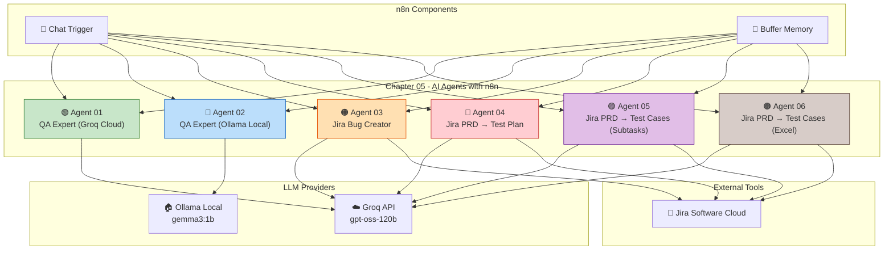

# 🤖 Chapter 05: AI Agents with n8n

<p align="center">
  <strong>AITesterBlueprint 2X — Batch 2X | The Testing Academy</strong><br/>
  <em>Build powerful no-code AI Agents for QA & Test Automation using n8n</em>
</p>

<p align="center">
  
  
  
  
</p>

---

## 📖 Table of Contents

- [What is n8n?](#-what-is-n8n)
- [Key Features of n8n](#-key-features-of-n8n)
- [Installation Guide](#-installation-guide)
  - [Install via npm](#1️⃣-install-via-npm)
  - [Install via Docker](#2️⃣-install-via-docker)
  - [Install via n8n.io (Cloud)](#3️⃣-install-via-n8nio-cloud)
  - [Platform-Specific Notes (macOS & Windows)](#4️⃣-platform-specific-notes)
- [How to Use n8n](#-how-to-use-n8n)
- [AI Agents in This Chapter](#-ai-agents-in-this-chapter)
  - [Agent 01 — QA AI Agent (Cloud LLM)](#agent-01--qa-ai-agent-cloud-llm)
  - [Agent 02 — QA AI Agent (Local Ollama)](#agent-02--qa-ai-agent-local-ollama)
  - [Agent 03 — Jira AI Agent (Bug Creator)](#agent-03--jira-ai-agent-bug-creator)
  - [Agent 04 — Jira AI Agent (PRD → Test Plan)](#agent-04--jira-ai-agent-prd--test-plan)
  - [Agent 05 — Jira AI Agent (PRD → Test Cases with Subtasks)](#agent-05--jira-ai-agent-prd--test-cases-with-subtasks)
  - [Agent 06 — Jira AI Agent (Export Test Cases to Excel)](#agent-06--jira-ai-agent-export-test-cases-to-excel)
- [How to Import These Agents](#-how-to-import-these-agents)
- [Architecture Overview](#-architecture-overview)
- [Author & Course Information](#-author--course-information)

---

## 🌐 What is n8n?

**[n8n](https://n8n.io/)** (pronounced *"nodemation"*) is a **free, open-source, and extendable workflow automation platform**. It lets you connect anything to everything — APIs, databases, AI models, SaaS tools, and custom scripts — through a visual, node-based interface.

Unlike many automation tools, n8n can be **self-hosted**, giving you full control over your data and workflows. With the rise of AI agents, n8n has become one of the most popular platforms for building **AI-powered automation workflows** that integrate directly with LLMs like OpenAI, Groq, Ollama, and more.

### Why n8n for QA & Testing?

- 🔗 **Direct integrations** with Jira, Confluence, Slack, GitHub, and CI/CD tools
- 🤖 **Built-in AI Agent nodes** supporting LangChain, tool-use, and memory
- 🏠 **Self-hosted option** — keeps test data private and secure
- 📊 **Visual workflow builder** — build complex QA workflows without writing code
- 🔄 **Event-driven triggers** — automate test pipelines based on webhooks, schedules, or chat

---

## ✨ Key Features of n8n

| Feature | Description |
| :--- | :--- |
| 🖼️ **Visual Workflow Editor** | Drag-and-drop node editor for building automation pipelines |
| 🔌 **400+ Integrations** | Pre-built connectors for Jira, Slack, GitHub, Google Sheets, databases, and more |
| 🤖 **AI Agent Nodes** | Native support for LangChain agents, LLM chat models, tools, and memory |
| 🧠 **Multiple LLM Support** | Connect to OpenAI, Groq, Ollama (local), Anthropic, HuggingFace, etc. |
| 🔐 **Self-Hosted** | Deploy on your own server — full data ownership and privacy |
| ☁️ **Cloud Option** | Use n8n.io cloud for a managed, zero-setup experience |
| 💬 **Chat Trigger** | Built-in chat interface for interacting with AI agents in real-time |
| 🗄️ **Memory & Context** | Buffer window memory for maintaining conversation history |
| 🛠️ **Custom Code Nodes** | Run JavaScript or Python within workflows for custom logic |
| 🔄 **Webhooks & Cron** | Trigger workflows via HTTP, schedules, or external events |
| 📦 **Import/Export** | Share workflows as JSON — easy team collaboration |
| 🌍 **Community & Templates** | Thousands of community-built workflow templates |

---

## 🚀 Installation Guide

### 1️⃣ Install via npm

> **Prerequisites:** Node.js v18.17 or above

#### macOS

```bash
# Install Node.js (if not already installed)
brew install node

# Install n8n globally
npm install n8n -g

# Start n8n
n8n start
```

#### Windows

```bash
# Install Node.js from https://nodejs.org (LTS version recommended)
# Open Command Prompt or PowerShell

# Install n8n globally
npm install n8n -g

# Start n8n
n8n start
```

Once started, open your browser and navigate to:

```
http://localhost:5678
```

---

### 2️⃣ Install via Docker

Docker is the recommended method for production and persistent setups.

#### Quick Start (Both macOS & Windows)

```bash
docker run -it --rm \
  --name n8n \
  -p 5678:5678 \
  -v n8n_data:/home/node/.n8n \
  docker.n8n.io/n8nio/n8n
```

#### Docker Compose (Recommended for Persistence)

Create a `docker-compose.yml` file:

```yaml
version: '3.8'

services:
  n8n:
    image: docker.n8n.io/n8nio/n8n
    container_name: n8n
    restart: always
    ports:
      - "5678:5678"
    volumes:
      - n8n_data:/home/node/.n8n
    environment:
      - N8N_BASIC_AUTH_ACTIVE=true
      - N8N_BASIC_AUTH_USER=admin
      - N8N_BASIC_AUTH_PASSWORD=changeme

volumes:
  n8n_data:
```

Then run:

```bash
docker-compose up -d
```

Access n8n at `http://localhost:5678`

---

### 3️⃣ Install via n8n.io (Cloud)

The easiest way to get started — no installation required!

1. Go to **[https://n8n.io](https://n8n.io)**
2. Click **"Get Started Free"**
3. Sign up with your email or Google/GitHub account
4. You'll get a fully managed n8n instance in the cloud
5. Start building workflows immediately!

> **💡 Tip:** The free tier is great for learning and experimenting with AI agents. Upgrade to a paid plan for production workloads and team collaboration.

---

### 4️⃣ Platform-Specific Notes

#### 🍎 macOS

| Method | Command / Steps |
| :--- | :--- |
| **Homebrew + npm** | `brew install node && npm install n8n -g && n8n start` |
| **Docker Desktop** | Install [Docker Desktop for Mac](https://www.docker.com/products/docker-desktop/), then use the Docker commands above |
| **n8n Cloud** | Visit [n8n.io](https://n8n.io) and sign up |

#### 🪟 Windows

| Method | Command / Steps |
| :--- | :--- |
| **npm** | Install [Node.js](https://nodejs.org), then `npm install n8n -g && n8n start` |
| **Docker Desktop** | Install [Docker Desktop for Windows](https://www.docker.com/products/docker-desktop/), enable WSL2, then use the Docker commands above |
| **n8n Cloud** | Visit [n8n.io](https://n8n.io) and sign up |

> ⚠️ **Windows Note:** If you encounter permission errors with npm, try running your terminal as Administrator, or use `npx n8n` instead of a global install.

---

## 🎯 How to Use n8n

1. **Launch n8n** using any of the installation methods above
2. **Create a new workflow** by clicking the `+` button
3. **Add nodes** by clicking the `+` button on the canvas:
   - **Triggers:** Define how a workflow starts (Chat, Webhook, Schedule, etc.)
   - **Actions:** Perform operations (Jira, Slack, HTTP Request, etc.)
   - **AI Nodes:** Add AI Agents, LLM Models, Memory, and Tools
4. **Connect nodes** by dragging edges between them
5. **Configure credentials** for external services (Jira, Groq API, Ollama, etc.)
6. **Test your workflow** using the "Execute Workflow" button
7. **Activate** your workflow to run it automatically on triggers

---

## 🤖 AI Agents in This Chapter

This chapter contains **six progressively complex AI agents** built in n8n, designed for QA and Testing workflows.

---

### Agent 01 — QA AI Agent (Cloud LLM)

📄 **File:** `AI_2X_01_QA_AI_AGENT.json`

| Property | Details |
| :--- | :--- |
| **Purpose** | A Senior QA & Test Automation Expert chatbot |
| **LLM Provider** | Groq Cloud (`openai/gpt-oss-120b`) |
| **Memory** | Buffer Window Memory (10 messages) |
| **Trigger** | Chat message |

#### What It Does

This agent acts as a **Senior QA and Test Automation Expert** with 15+ years of experience. It:

- ✅ Answers questions about QA, software testing, and test automation
- 🚫 Strictly refuses non-QA questions (cooking, travel, etc.)
- 🧠 Remembers previous conversation context (name, preferences, etc.)
- 📋 Covers: test strategy, automation frameworks (Selenium, Playwright, Cypress, Appium), API testing, CI/CD, performance testing, AI/ML testing, and more

#### Workflow Architecture

```
Chat Trigger → AI Agent ← Groq LLM (Cloud)
                  ↑
            Simple Memory
```

---

### Agent 02 — QA AI Agent (Local Ollama)

📄 **File:** `AI_2X_02_Local_Ollama_QA_AI_AGENT.json`

| Property | Details |
| :--- | :--- |
| **Purpose** | Same QA Expert agent, but running on a local LLM |
| **LLM Provider** | Ollama (local) — `gemma3:1b` model |
| **Memory** | Buffer Window Memory (10 messages) |
| **Trigger** | Chat message |

#### What It Does

Identical functionality to Agent 01, but uses a **locally hosted Ollama model** instead of a cloud API. This is ideal for:

- 🔐 **Privacy** — No data leaves your machine
- 💰 **Cost savings** — No API fees
- 🏃 **Offline usage** — Works without internet
- 🧪 **Experimentation** — Test with different local models

#### Prerequisites

```bash
# Install Ollama
curl -fsSL https://ollama.com/install.sh | sh    # Linux/macOS
# Windows: Download from https://ollama.com/download

# Pull the model
ollama pull gemma3:1b

# Verify it's running
ollama list
```

#### Workflow Architecture

```
Chat Trigger → AI Agent ← Ollama Chat Model (Local)
                  ↑
            Simple Memory
```

---

### Agent 03 — Jira AI Agent (Bug Creator)

📄 **File:** `AI_2X_03_JIRA_AI_AGENT.json`

| Property | Details |
| :--- | :--- |
| **Purpose** | AI Agent that creates bug tickets in Jira via natural language |
| **LLM Provider** | Groq Cloud (`openai/gpt-oss-120b`) |
| **Tool** | Jira Software — Create Issue |
| **Memory** | Buffer Window Memory |
| **Trigger** | Chat message (public) |

#### What It Does

This agent connects to **Jira Software Cloud** and can **automatically create bug tickets** based on natural language conversation:

- 💬 Describe a bug in plain English
- 🤖 The AI Agent extracts the summary and description
- 🐛 Automatically creates a **Bug** issue in the configured Jira project
- 📝 Uses AI-powered field extraction (`$fromAI()`) for smart field mapping

#### Example Usage

```
User: "The login page throws a 500 error when using special characters in the password field"

Agent: ✅ Created Jira Bug: VWO-123
  Summary: Login page 500 error with special characters in password
  Description: When users enter special characters in the password field
  on the login page, the server returns a 500 Internal Server Error...
```

#### Workflow Architecture

```
Chat Trigger → AI Agent ← Groq LLM (Cloud)
                  ↑  ↑
      Simple Memory  Jira Tool (Create Bug)
```

---

### Agent 04 — Jira AI Agent (PRD → Test Plan)

📄 **File:** `AI_2X_04_JIRA_AI_AGENT_READ_PRD_Test_Plan.json`

| Property | Details |
| :--- | :--- |
| **Purpose** | Reads a Jira ticket/story/PRD and generates a comprehensive test plan |
| **LLM Provider** | Groq Cloud (`openai/gpt-oss-120b`) |
| **Tool** | Jira Software — Read/Get Issue |
| **Memory** | Buffer Window Memory |
| **Trigger** | Chat message (public) |

#### What It Does

The most advanced agent in this chapter! It:

- 📥 **Reads** a Jira ticket (story, bug, or PRD) by ticket ID
- 🧠 **Analyzes** the ticket content using the LLM
- 📋 **Generates** a comprehensive test plan based on the requirements
- 🔄 Maintains conversation memory for follow-up questions

#### Example Usage

```
User: "Create a test plan for VWO-456"

Agent: 📋 Test Plan for VWO-456: User Registration Feature

  1. Functional Test Cases:
     - TC01: Verify successful registration with valid data
     - TC02: Verify email validation
     - TC03: Verify password strength requirements
     ...

  2. Edge Cases:
     - TC10: Verify duplicate email handling
     - TC11: Verify SQL injection prevention
     ...

  3. API Test Cases:
     - TC15: Verify POST /api/register endpoint
     ...
```

#### Workflow Architecture

```
Chat Trigger → AI Agent ← Groq LLM (Cloud)
                  ↑  ↑
      Simple Memory  Jira Tool (Read Ticket)
```

---

### Agent 05 — Jira AI Agent (PRD → Test Cases with Subtasks)

📄 **File:** `AI_2X_05_TestCase_Gen_with_PRD_JIRA.json`

| Property | Details |
| :--- | :--- |
| **Purpose** | Reads a Jira PRD, generates test cases, and creates them as Subtasks under a main Jira ticket |
| **LLM Provider** | Groq Cloud (`openai/gpt-oss-120b`) |
| **Tool** | Jira Software — Read Issue, Create Issue |
| **Memory** | Buffer Window Memory |
| **Trigger** | Chat message / Webhook |

#### What It Does

This agent builds on Agent 04 by directly taking action in Jira:

- 📥 **Reads** a Jira ticket (PRD/Story)
- 🧠 **Analyzes** requirements and designs comprehensive Test Cases
- 🛠️ **Creates** a parent Test Plan ticket or operates within an Epic
- 🔄 **Generates and links** each test case as a Subtask automatically in Jira

#### Workflow Architecture

```text
Chat Trigger → AI Agent ← Groq LLM (Cloud)
                  ↑  ↑
      Simple Memory  Jira Tool (Read PRD, Create Subtasks)
```

---

### Agent 06 — Jira AI Agent (Export Test Cases to Excel)

📄 **File:** `AI_2X_06_TestCase_Gen_with_PRD_JIRA_Export_Excel.json`

| Property | Details |
| :--- | :--- |
| **Purpose** | Generates test cases from a PRD/Jira ticket and exports them directly to an Excel file |
| **LLM Provider** | Groq Cloud (`openai/gpt-oss-120b`) |
| **Tool** | Jira Software, Spreadsheet/Excel Nodes |
| **Memory** | Buffer Window Memory |
| **Trigger** | Chat message / Webhook |

#### What It Does

A powerful utility agent for teams that need test documentation in traditional spreadsheet formats:

- 📥 **Fetches** Jira ticket details or PRD
- 🧠 **Generates** detailed test cases with fields (ID, Summary, Pre-conditions, Steps, Expected Result)
- 📊 **Converts** the structured LLM output into standardized rows and columns
- 💾 **Exports** the result as a downloadable `.xlsx` or `.csv` file

#### Workflow Architecture

```text
Chat Trigger → AI Agent ← Groq LLM (Cloud)
                  ↑  ↑
      Simple Memory  Jira Tool (Read Ticket) -> Spreadsheet Generation -> Excel Download
```

---

## 📥 How to Import These Agents

1. Open your n8n instance (`http://localhost:5678` or your cloud URL)
2. Click the **three-dot menu (⋯)** in the top-right corner
3. Select **"Import from File"**
4. Choose the desired `.json` file from this directory
5. Configure the required **credentials**:
   - **Groq API Key** — for Agents 01, 03, 04, 05, and 06
   - **Ollama Connection** — for Agent 02 (ensure Ollama is running locally)
   - **Jira Cloud API** — for Agents 03, 04, 05, and 06 (requires Jira email + API token)
6. Click **"Save"** and then **"Execute"** or **"Activate"** the workflow

---

## 🏗️ Architecture Overview



---

## 📂 Files in This Directory

| File | Description |
| :--- | :--- |
| `AI_2X_01_QA_AI_AGENT.json` | QA Expert AI Agent powered by Groq Cloud LLM |
| `AI_2X_02_Local_Ollama_QA_AI_AGENT.json` | QA Expert AI Agent powered by local Ollama (gemma3:1b) |
| `AI_2X_03_JIRA_AI_AGENT.json` | AI Agent that creates bug tickets in Jira via chat |
| `AI_2X_04_JIRA_AI_AGENT_READ_PRD_Test_Plan.json` | AI Agent that reads Jira tickets and generates test plans |
| `AI_2X_05_TestCase_Gen_with_PRD_JIRA.json` | AI Agent that creates test cases as Subtasks in Jira |
| `AI_2X_06_TestCase_Gen_with_PRD_JIRA_Export_Excel.json` | AI Agent that generates and exports test cases to Excel |
| `README.md` | This documentation file |

---

## 👨‍💻 Author & Course Information

<table>
  <tr>
    <td><strong>Author</strong></td>
    <td><strong>Pramod Dutta</strong></td>
  </tr>
  <tr>
    <td><strong>Academy</strong></td>
    <td><a href="https://thetestingacademy.com">The Testing Academy</a></td>
  </tr>
  <tr>
    <td><strong>Course</strong></td>
    <td><strong>AI Tester Blueprint 2X (AITesterBlueprint2X)</strong></td>
  </tr>
  <tr>
    <td><strong>Batch</strong></td>
    <td><strong>Batch 2X</strong></td>
  </tr>
  <tr>
    <td><strong>YouTube</strong></td>
    <td><a href="https://youtube.com/@thetestingacademy">The Testing Academy</a></td>
  </tr>
  <tr>
    <td><strong>LinkedIn</strong></td>
    <td><a href="https://linkedin.com/in/interloperinc">Pramod Dutta</a></td>
  </tr>
  <tr>
    <td><strong>GitHub</strong></td>
    <td><a href="https://github.com/PramodDutta">PramodDutta</a></td>
  </tr>
  <tr>
    <td><strong>Repository</strong></td>
    <td><a href="https://github.com/PramodDutta/AITesterBlueprint2x">AITesterBlueprint2x</a></td>
  </tr>
</table>

---

<p align="center">
  <strong>🚀 Part of the AI Tester Blueprint 2X Course by The Testing Academy</strong><br/>
  <em>Empowering QA Engineers with AI-driven testing workflows</em><br/><br/>
  ⭐ Star this repo if you found it helpful!
</p>
