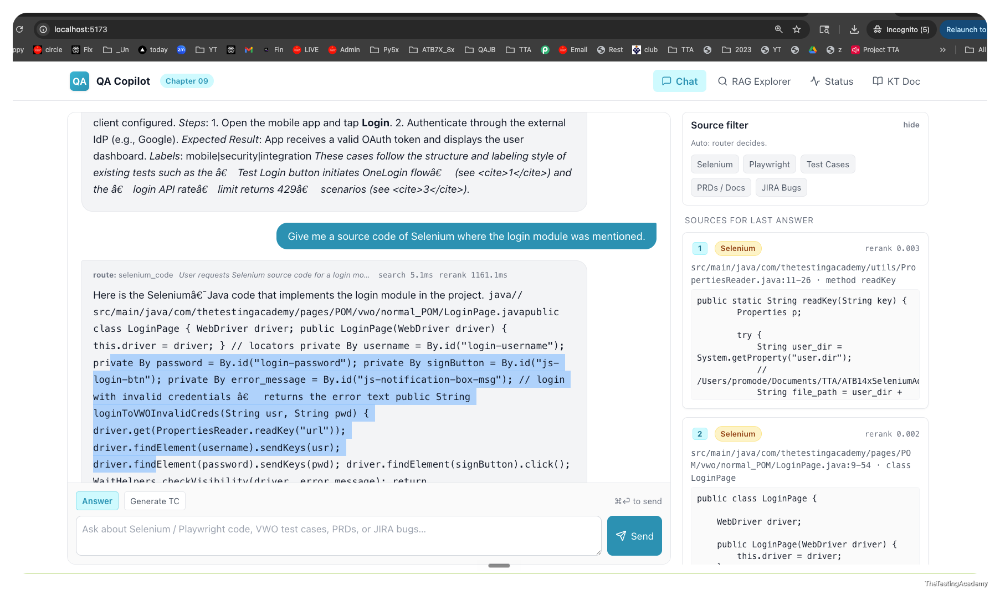
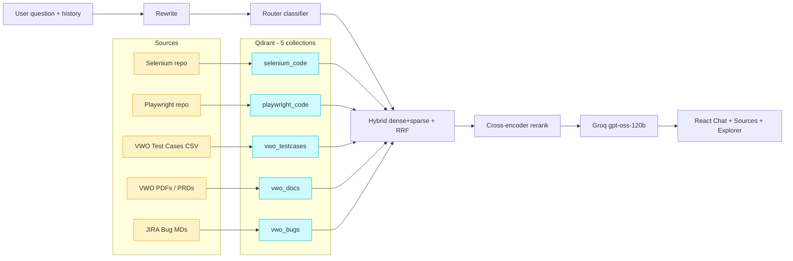

# Chapter 9 — QA Copilot

Multi-source Retrieval-Augmented Generation for QA engineers. Ask one question, get a
cited answer grounded in your Selenium framework, your Playwright framework, your VWO
test case repository, your PRDs, and your JIRA bug history.



The capstone of the RAG track in **AI Tester Blueprint 2x**:

- Chapter 8 Basic — ChromaDB + Nomic Embed + Groq, simple RAG.
- Chapter 8 Advance — Qdrant + BGE-M3 hybrid + cross-encoder rerank, single corpus.
- **Chapter 9 — multi-collection RAG with intent routing and a built-in RAG Explorer.**

---

## Architecture



## Stack

| Concern | Tool |
|---|---|
| Vector DB | Qdrant (embedded file-store, no Docker required) |
| Embedder | BGE-M3 (FlagEmbedding) — produces dense (1024d) + sparse from one model |
| Reranker | BGE-Reranker-v2-m3 cross-encoder |
| LLM | Groq · `openai/gpt-oss-120b` (streaming) |
| Backend | FastAPI · SSE for chat, JSON for explore |
| Frontend | Vite · React · TypeScript · Tailwind · react-router-dom |
| Code chunking | tree-sitter-java, tree-sitter-typescript |
| Doc chunking | PyMuPDF (PDFs) · regex JIRA-MD parser |

## Five Collections

| Collection | Source | Chunk strategy | Key metadata |
|---|---|---|---|
| `selenium_code` | `data/selenium_repo/**/*.java` | one chunk per method/class | path, package, symbol, kind, lines |
| `playwright_code` | `data/playwright_repo/**/*.{ts,js}` | per fn/class + each `test()` block | path, kind, symbol, test_title |
| `vwo_testcases` | `data/csv/testcases_vwo_100.csv` | row-aware (1 TC = 1 chunk) | tc_id, jira_id, module, priority, severity, sprint, status |
| `vwo_docs` | `data/pdf/*.pdf` | PyMuPDF page text + sliding window | doc_title, page |
| `vwo_bugs` | `data/md/Bug_VWO_*.md` | parse JIRA header, chunk body | jira_id, status, priority, summary, reporter |

## Run

```bash
# 1. Source repos (cloned into gitignored dirs)
git clone https://github.com/PramodDutta/ATB14xSeleniumAdvanceFrameworks data/selenium_repo
git clone https://github.com/PramodDutta/Advance-Playwright-Framework  data/playwright_repo

# 2. Backend
python -m venv .venv && source .venv/bin/activate
pip install -r backend/requirements.txt
cp .env.example .env       # then add your GROQ_API_KEY
python -m backend.ingest.ingest_all
uvicorn backend.main:app --reload --port 8000

# 3. Frontend
cd frontend
npm install
npm run dev                # http://localhost:5173
```

Then ask one smoke question per collection:

| Collection | Try |
|---|---|
| `selenium_code` | "Show the BasePage waitForElement implementation" |
| `playwright_code` | "How is the login fixture set up in Playwright?" |
| `vwo_testcases` | "List P0 Blocker test cases for the Admin module" |
| `vwo_docs` | "What does the PRD say about login dashboard auth flow?" |
| `vwo_bugs` | "Show open bugs related to login failures" |

## RAG Explorer

The `/explorer` page is a debugger. Replay any question and see every stage:

```
01 Query Rewrite
02 Router Decision
03 Per-Collection Hits  (dense / sparse / fused)
04 Rerank
05 Final Context Blocks  (the exact <doc> blocks the LLM sees)
06 LLM Call              (system prompt, user message, model, tokens, timings)
07 Answer
```

If an answer surprises you, replay it in the Explorer. 9 times out of 10 the bug is
upstream of the LLM — wrong router pick, missing chunk, bad rerank.

See `KT/index.html` for the full design walkthrough (open from the header link in the UI).

## Files

```
backend/
  main.py                 FastAPI app · /api/chat (SSE) · /api/explore · /api/health
  lib/
    settings.py           env loader, COLLECTIONS = source of truth
    embeddings.py         BGE-M3 dense+sparse
    reranker.py           BGE-Reranker-v2-m3
    qdrant_store.py       5-collection bootstrap, hybrid search, RRF
    router.py             Groq JSON-mode classifier
    retriever.py          rewrite -> route -> hybrid -> rerank, returns trace
    prompts.py            router / rewrite / answer / generate prompts
    groq_client.py        REST + streaming
    chunking_text.py      row-aware + sliding window
    chunking_code.py      tree-sitter Java + TS
    chunking_md_pdf.py    PyMuPDF + JIRA-MD parser
  ingest/
    ingest_selenium.py
    ingest_playwright.py
    ingest_testcases.py
    ingest_pdfs.py
    ingest_jira.py
    ingest_all.py
frontend/
  src/
    pages/{Chat,Explorer,Status}.tsx
    components/{SourceFilter,SourcePanel,MarkdownAnswer}.tsx
    api/client.ts
KT/
  index.html              architecture diagram + components + RAG explorer doc
data/
  selenium_repo/  playwright_repo/  csv/  pdf/  md/
```

## Hourly Scheduler

Re-index Qdrant on a fixed cadence (default every 60 minutes) without extra services.

```bash
# Long-lived in-process loop
python -m scheduler.run

# One cycle then exit (cron / launchd / systemd)
python -m scheduler.run --once
```

Knobs (in `.env`):

| Variable | Default | Purpose |
|---|---|---|
| `INGEST_INTERVAL_MINUTES` | 60 | Minutes between cycles |
| `INGEST_AT_STARTUP` | true | Run one cycle immediately, then loop |
| `INGEST_TARGETS` | all 5 | Comma-list: `selenium,playwright,testcases,pdfs,jira` |
| `INGEST_RECREATE` | false | Drop+rebuild collections each cycle |
| `INGEST_LOCK_FILE` | `./data/.ingest.lock` | Skips overlapping cycles |

See `scheduler/README.md` for macOS launchd + Linux systemd timer snippets.

> Single-process Qdrant (file-store) cannot run scheduler + API simultaneously. Switch
> to HTTP mode (`QDRANT_URL=http://127.0.0.1:6333`) for production deployments.

---

## Deployment Guide — VPS · AWS · DigitalOcean · GCP

Reference architecture:

```
Browser ──HTTPS──> Nginx ──/api/*──> uvicorn (FastAPI) ──HTTP──> Qdrant (Docker :6333)
                       └──/────────> React static (frontend/dist)
                                     systemd timer ──hourly──> scheduler.run --once
```

### Sizing

| Tier | Specs | Notes |
|---|---|---|
| Demo / single-user | 2 vCPU · 4 GB · 20 GB | CPU embeddings ok for < 5k chunks |
| Team (recommended) | 4 vCPU · 8–16 GB · 40 GB | BGE-M3 + reranker comfortable; up to ~50k chunks |
| GPU (optional) | + 1× T4 / L4 | 10× faster ingest & rerank |

### 1. Provision a VPS (any provider)

Ubuntu 22.04 / 24.04 LTS. Open ports 22 + 443 only. Keep 8001 / 6333 / 5173 internal.

```bash
# DigitalOcean
doctl compute droplet create qacopilot \
  --image ubuntu-24-04-x64 --size s-4vcpu-8gb --region blr1 \
  --ssh-keys $SSH_KEY_ID

# AWS EC2
aws ec2 run-instances --image-id ami-0c7217cdde317cfec \
  --instance-type t3.large --key-name $KEY \
  --block-device-mappings 'DeviceName=/dev/sda1,Ebs={VolumeSize=40,VolumeType=gp3}'

# GCP
gcloud compute instances create qacopilot \
  --machine-type=e2-standard-4 \
  --image-family=ubuntu-2404-lts --image-project=ubuntu-os-cloud \
  --boot-disk-size=40GB --zone=asia-south1-a

# Hetzner / Linode / Vultr — provision via web UI then:
ssh root@$IP
adduser qacopilot && usermod -aG sudo qacopilot
ufw allow OpenSSH && ufw allow 'Nginx Full' && ufw enable
```

### 2. System bootstrap

```bash
sudo apt update && sudo apt install -y \
  python3.12 python3.12-venv python3-pip \
  build-essential git curl nginx docker.io ca-certificates

curl -fsSL https://deb.nodesource.com/setup_20.x | sudo bash -
sudo apt install -y nodejs

sudo systemctl enable --now docker
sudo mkdir -p /opt/qacopilot && sudo chown $USER /opt/qacopilot
```

### 3. App + dependencies

```bash
cd /opt/qacopilot
git clone https://github.com/<you>/AITesterBlueprint2x .
cd Chapter_09_Project_QACopilot
git clone --depth 1 https://github.com/PramodDutta/ATB14xSeleniumAdvanceFrameworks data/selenium_repo
git clone --depth 1 https://github.com/PramodDutta/Advance-Playwright-Framework  data/playwright_repo

python3.12 -m venv .venv && source .venv/bin/activate
pip install -r backend/requirements.txt
cp .env.example .env       # edit: GROQ_API_KEY=...  QDRANT_URL=http://127.0.0.1:6333
```

### 4. Qdrant in HTTP mode

```bash
sudo docker run -d --name qdrant --restart=always \
  -p 127.0.0.1:6333:6333 \
  -v /opt/qacopilot/qdrant_storage:/qdrant/storage \
  qdrant/qdrant:latest

python -m backend.ingest.ingest_all     # initial fill
```

### 5. systemd unit for the API

```ini
# /etc/systemd/system/qacopilot-api.service
[Unit]
Description=QA Copilot FastAPI
After=network-online.target docker.service

[Service]
Type=simple
User=qacopilot
WorkingDirectory=/opt/qacopilot/Chapter_09_Project_QACopilot
EnvironmentFile=/opt/qacopilot/Chapter_09_Project_QACopilot/.env
ExecStart=/opt/qacopilot/Chapter_09_Project_QACopilot/.venv/bin/uvicorn \
  backend.main:app --host 127.0.0.1 --port 8001 --workers 2
Restart=on-failure

[Install]
WantedBy=multi-user.target
```

```bash
sudo systemctl daemon-reload
sudo systemctl enable --now qacopilot-api
```

### 6. Build the frontend

```bash
cd /opt/qacopilot/Chapter_09_Project_QACopilot/frontend
npm ci && npm run build       # outputs frontend/dist/
```

### 7. Nginx + Let's Encrypt

```nginx
# /etc/nginx/sites-available/qacopilot.conf
server {
    listen 80;
    server_name copilot.example.com;

    root /opt/qacopilot/Chapter_09_Project_QACopilot/frontend/dist;
    index index.html;
    location / { try_files $uri $uri/ /index.html; }

    location /api/ {
        proxy_pass http://127.0.0.1:8001;
        proxy_set_header Host $host;
    }

    # SSE streaming - disable buffering
    location /api/chat {
        proxy_pass http://127.0.0.1:8001;
        proxy_buffering off;
        proxy_cache off;
        proxy_read_timeout 300s;
        proxy_set_header Connection "";
        chunked_transfer_encoding on;
    }

    location /KT/ {
        alias /opt/qacopilot/Chapter_09_Project_QACopilot/KT/;
    }
}
```

```bash
sudo ln -s /etc/nginx/sites-available/qacopilot.conf /etc/nginx/sites-enabled/
sudo nginx -t && sudo systemctl reload nginx
sudo apt install -y certbot python3-certbot-nginx
sudo certbot --nginx -d copilot.example.com
```

### 8. Schedule the hourly ingest

Drop the systemd timer from `scheduler/README.md` into `/etc/systemd/system/`, then:

```bash
sudo systemctl daemon-reload
sudo systemctl enable --now qacopilot-ingest.timer
sudo systemctl list-timers | grep qacopilot
```

### Operational notes

- **Secrets:** keep `GROQ_API_KEY` in `.env` (chmod 600), never in `.env.example`. AWS/GCP — use Secrets Manager / Secret Manager and inject at deploy.
- **Backups:** snapshot `/opt/qacopilot/qdrant_storage` nightly. Re-ingest is idempotent DR.
- **Updates:** `git pull && pip install -r backend/requirements.txt && (cd frontend && npm run build) && sudo systemctl restart qacopilot-api`.
- **Observability:** `journalctl -u qacopilot-api -f` · `tail -f data/_scheduler.log` · UI `/status`.
- **GPU (optional):** AWS `g5.xlarge` / GCP `n1-standard-4 + T4`. Install CUDA-enabled torch wheel + nvidia-container-toolkit for Docker.
- **Container alt:** Dockerise FastAPI; deploy to AWS ECS Fargate / GCP Cloud Run (request timeout 300s for SSE).

---

## Author

**Pramod Dutta** · Principal SDET · The Testing Academy · 2026 Edition
