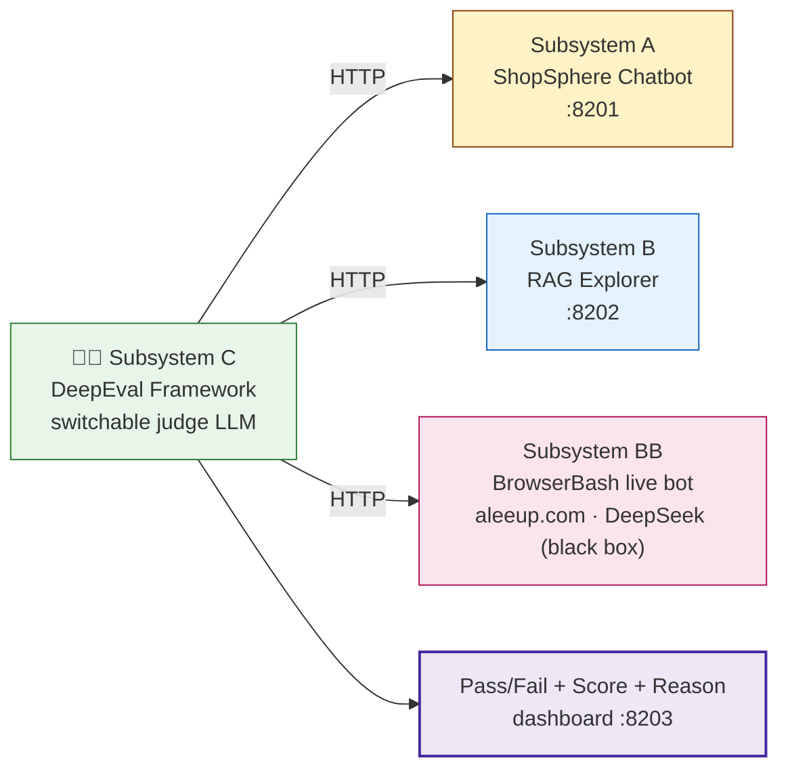
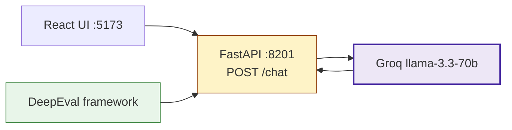
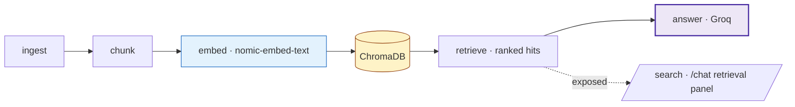
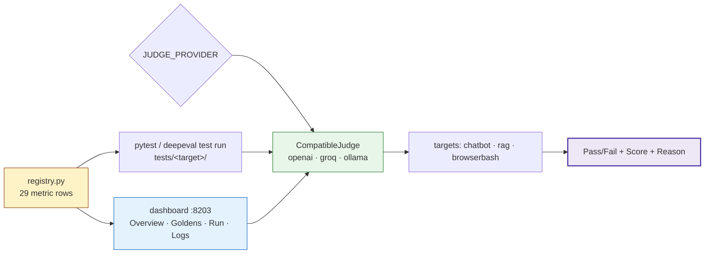
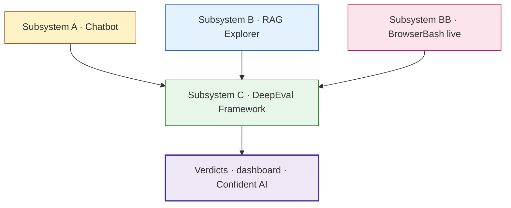

# Chapter 19 · DeepEval Framework — Evaluating Real Chatbot + RAG Systems

**Directory:** `Chapter_19_DeepEval_Framework/`

Where [Chapter 18](../Chapter_18_DeepEval/) scores *single prompts*, Chapter 19 scores
**live, production-shaped systems**. Three real apps under test are graded by a single
switchable **LLM-as-judge** harness on relevancy, faithfulness, grounding, hallucination,
bias, toxicity, correctness and PII leakage.

The chapter is split into three subsystems that build on each other:

| # | Subsystem | Folder | Role |
|:---:|:---|:---|:---|
| **A** | ShopSphere Chatbot | `01_Chatbot/` | App under test — React + FastAPI + Groq |
| **B** | RAG Explorer | `02_RAG_Explorer/` | App under test — Ollama embed + ChromaDB + Groq |
| **C** | DeepEval Framework | `03_DeepFramework/` | The judge harness that grades A, B **and** a live black-box bot |



---

## A — ShopSphere E-commerce Chatbot

**Concept:** A real customer-support chatbot — React (Vite) frontend + FastAPI backend +
Groq `llama-3.3-70b-versatile` — that you point the judge at. It is the simplest "app under test."

**Why:** You can only learn LLM-as-judge against something that actually answers. A live bot
gives you non-deterministic replies to grade, exactly like production.

**Q&A — why use this?**
- **Q: Do I need a Groq key to run it?** A: No — without `GROQ_API_KEY` it falls back to mock mode, so the framework still has a target to hit.
- **Q: What does the judge talk to?** A: The FastAPI backend on `:8201` (`POST /chat`), not the React UI. The UI is for humans; the framework is HTTP-only.
- **Q: What's the contract?** A: `POST /chat {message, history?}` → `{reply, model, mode}`.



```bash
# backend (the framework hits this)
cd 01_Chatbot/shopeasy_chatbot/01_chatbot/backend
pip install -r requirements.txt
export GROQ_API_KEY=gsk_...
uvicorn app:app --reload --port 8201

# frontend (humans only)
cd ../frontend && npm install && npm run dev   # http://localhost:5173
```

See [`01_Chatbot/shopeasy_chatbot/01_chatbot/README.md`](01_Chatbot/shopeasy_chatbot/01_chatbot/README.md).

---

## B — RAG Explorer

**Concept:** A complete, locally-runnable RAG pipeline that **exposes every stage** —
`ingest → chunk → embed (nomic-embed-text via Ollama) → store (ChromaDB) → retrieve → answer (Groq)` —
so retrieval, faithfulness and grounding can each be audited.

**Why:** Most RAG demos hide retrieval behind the chat reply. DeepEval needs the *retrieval
context* to score contextual precision/recall/relevancy and faithfulness — so this app surfaces
the raw chunks and ranked hits on purpose.

**Q&A — why use this?**
- **Q: Why expose the chunks instead of just the answer?** A: Metrics like contextual recall and citation quality grade the *retrieval*, not just the final text — they need the retrieved chunks as evidence.
- **Q: What's the bundled corpus?** A: 5 e-commerce knowledge files (refund, shipping, return policies, product catalog, FAQ) — rich enough to stress-test hallucination and grounding.
- **Q: Ollama required?** A: Yes for embeddings (`ollama pull nomic-embed-text`); Groq answers fall back to mock mode without a key.



```bash
cd 02_RAG_Explorer/02_rag_explorer
pip install -r requirements.txt
ollama pull nomic-embed-text
export GROQ_API_KEY=gsk_...
uvicorn app:app --reload --port 8202        # http://localhost:8202
# POST /api/chat {message, top_k} → reply + retrieval_context
```

See [`02_RAG_Explorer/02_rag_explorer/README.md`](02_RAG_Explorer/02_rag_explorer/README.md).

---

## C — DeepEval Framework (the judge harness)

**Concept:** One metric registry (`dashboard/registry.py`, **29 metric × target rows**) drives
**two surfaces** — a `pytest` / `deepeval test run` CI suite *and* an interactive web dashboard —
against **three targets**: the local chatbot (A), the local RAG app (B), and **BrowserBash (BB)**,
a live black-box bot on `aleeup.com` answered server-side by DeepSeek that we only reach over HTTP.

**Why:** The judge LLM is deliberately separate from every app under test — that separation is the
whole point of LLM-as-judge. And evaluating a vendor bot you *don't* control (BB) is the realistic case.

**Q&A — why use this?**
- **Q: How do I switch the judge?** A: One env var. `JUDGE_PROVIDER=openai|groq|ollama` — the same `CompatibleJudge` works for all three because each exposes an OpenAI-compatible endpoint (`instructor` handles structured output).
- **Q: pytest or dashboard?** A: pytest for CI (per-golden cases, markers, optional Confident AI push); the `:8203` dashboard for teaching/demos (click a metric → live score/pass/fail/reason, edit goldens, browse local run history).
- **Q: Why is BrowserBash a "black box"?** A: It returns **plain text** (not JSON), takes `{message, visitorId}`, and we never see its model — exactly how you'd grade a third-party chatbot in production.



```bash
cd 03_DeepFramework
python3 -m venv venv && source venv/bin/activate
pip install -r requirements.txt

# pick a judge (.env auto-loaded by conftest / the dashboard)
export JUDGE_PROVIDER=openai          # or groq / ollama

# 1) pytest — CI, per-golden cases (targets A :8201, B :8202 must be up; BB is live)
pytest tests/chatbot/ -v              # or tests/rag/ · tests/aleepup-browserbash-chatbot/
pytest -m "chatbot and quality" -v    # filter by marker

# 2) interactive dashboard — click any metric, live verdict
uvicorn dashboard.app:app --port 8203 # http://localhost:8203
```

**Metric coverage (29 rows):** 10 chatbot · 11 RAG · 7 BrowserBash · 1 synthetic.

| Scoring direction | Metrics |
|:---|:---|
| Higher is better (threshold = floor) | answer relevancy, faithfulness, contextual precision/recall/relevancy, G-Evals (correctness, citation, helpfulness, completeness), conversation completeness, knowledge retention, summarization |
| Lower is better (threshold = ceiling) | hallucination, bias, toxicity, PII leakage |

> **deepeval pinned to `3.9.9`.** `4.0.6` ships a broken `deepeval test run` CLI; `3.9.9` is the last release whose CLI works out of the box and still has every metric the registry uses.

See [`03_DeepFramework/README.md`](03_DeepFramework/README.md) for the full file map and the
self-contained [`03_DeepFramework/docs/index.html`](03_DeepFramework/docs/index.html) overview.

---

## How the pieces fit



This pairs with [Chapter 20 · BrowserBash](../Chapter_20_Browserbash/): there you **drive** the
live bot through a plain-English E2E journey; here you **grade** that same bot (Subsystem BB).

> Every subsystem keeps its own gitignored `.env` — never commit real keys. Set
> `GROQ_API_KEY` / `OPENAI_API_KEY` / `CONFIDENT_API_KEY` per subsystem as needed.
