# Automation Desktop Blueprint by 2x - SDET Course

Welcome to the **Automation Desktop Blueprint by 2x** repository! This project serves as a comprehensive guide to understanding and integrating Artificial Intelligence (AI) and Large Language Models (LLMs) into modern software testing and Quality Assurance (QA) workflows.

The repository is structured systematically into chapters, covering theoretical concepts, practical exercises, and real-world projects to take you from fundamentals to advanced AI-assisted test automation.

---

## 🗺️ Course Learning Flow

To get the most out of this repository, we recommend following this progressive workflow for each chapter:

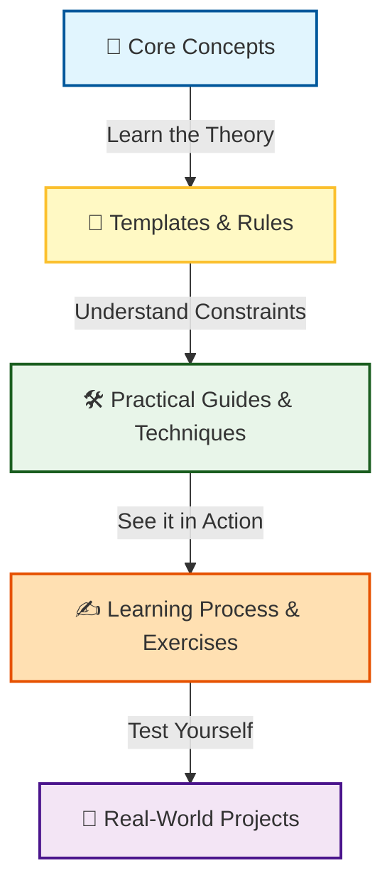

1. **`core_concepts/`**: Start here. Read these markdown files to build your foundational knowledge and terminology.
2. **`rules_checklists/` & `templates/`**: Utilize reusable templates and strict rules (e.g., Anti-Hallucination guidelines, B.L.A.S.T.) to enforce consistency in your AI interactions.
3. **`practical_guides/` & `techniques/`**: Explore these folders for step-by-step tutorials and prompt strategies (like RICE-POT).
4. **`learning_practice/`**: Engage in hands-on, self-directed exercises (and refer to the solutions) to reinforce your learning.
5. **`Project_.../`**: Synthesize and apply everything you have learned to comprehensive testing challenges and enterprise frameworks.

---

## 📖 Chapter 1: LLM Basics

**Directory:** `Chapter_01_LLM_BASICS/`

In this foundational chapter, we explore the basics of Large Language Models (LLMs) and how to leverage them (both local and cloud-based APIs) for generating reliable test automation scripts. We establish critical guardrails like the Anti-Hallucination rules and the B.L.A.S.T. master system prompt to prevent AI drift or fabricated outputs.

### Chapter 1 Learning Path

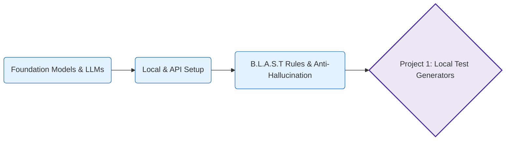

### Chapter 1 Curriculum & Projects

| Type | Folder / Module | Description |
| :---: | :--- | :--- |
| **📚 Learning** | `core_concepts/` | Architectural fundamentals of Foundation Models and LLM definitions. |
| **📚 Learning** | `practical_guides/` | Practical guidance on setting up and interacting with LLMs locally and via APIs (such as Groq API). |
| **📚 Learning** | `rules_checklists/` | Critical guardrails including the Anti-Hallucination rule-sets and the B.L.A.S.T. framework. |
| **📚 Learning** | `learning_practice/` | Foundational exercises to practice basic LLM interaction skills and test prompt behavior. |
| **🚀 Project** | `Project_01_LocalLLMTestGenerator` | **Standalone App**: Building a standard, self-contained local application for generating tests using local models. |
| **🚀 Project** | `Project_01_LocalLLMTestGenerator_Antigravity` | **Agentic Architecture**: A specialized test generator built using an advanced agentic system (Antigravity). |
| **🚀 Project** | `LocalLLMTestGenBuddy` | **Submodule Component**: A reusable codebase component utilized for assisting local test generation contexts. |

---

## 📖 Chapter 2: Prompt Engineering

**Directory:** `Chapter_02_PROMPT_ENGINEERING/`

This chapter dives deep into the art and science of **Prompt Engineering** tailored specifically for automation engineers. We introduce vital prompt frameworks—like **RICE-POT** (Role, Instructions, Context, Example, Parameters, Output, Tone)—and use advanced techniques to generate enterprise-grade automation frameworks, ensuring strict compliance with production-level standards.

### Chapter 2 Learning Path

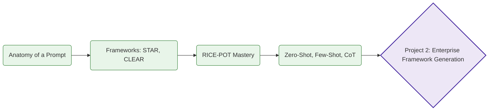

### Chapter 2 Curriculum & Projects

| Type | Folder / Module | Description |
| :---: | :--- | :--- |
| **📚 Learning** | `core_concepts/` | The core anatomy of prompts and overviews of standard frameworks like STAR, CLEAR, and CRISP. |
| **📚 Learning** | `techniques/` | Deep-dives into advanced QA techniques: Few-Shot, Chain-of-Thought, Zero-Shot, and Role-playing. |
| **📚 Learning** | `practical_guides/` | Step-by-step practical guides to writing effective QA and automation instructions from scratch. |
| **📚 Learning** | `learning_practice/` | Hands-on prompt engineering exercises with detailed, documented solutions for practical mastery. |
| **🚀 Project** | `Project_02_Prompt_Templates` | **Template Engine**: A repository containing reusable, high-quality prompt templates specifically designed for QA Tasks (e.g., API testing, Bug Reports). |
| **🚀 Project** | `Project_02_REAL_PROJECT_PE` | **Test Planning via LLMs**: Applying prompt engineering to ingest a real-world product context (VWO Platform) to auto-generate thorough Test Plans. |
| **🚀 Project** | `Project_02_RICE_POT_Selenium_FW` | **Framework Generation**: Using the RICE-POT framework to completely architect and generate an enterprise-grade Selenium TestNG Page Object Model. |
| **🚀 Project** | `Project_03_RICE_POT_Playwright_Advance_FQ` | **Advanced UI Testing**: Extending prompt engineering capabilities to architect and build robust end-to-end modern testing solutions using Playwright. |

---

## 📖 Chapter 8: Retrieval Augmented Generation (RAG)

**Directory:** `Chapter_08_RAG/`

In this chapter, we introduce **Retrieval Augmented Generation (RAG)** — the technique that grounds an LLM in your own documents instead of relying purely on its training data. We start with the most important building block of any RAG pipeline: **chunking and embeddings**. Using a small story document about *Promo and The Testing Academy*, we split the text into overlapping chunks and convert each chunk into a 768-dimensional vector using the **Nomic Embed** model running locally through **Ollama**.

### Chapter 8 Learning Path

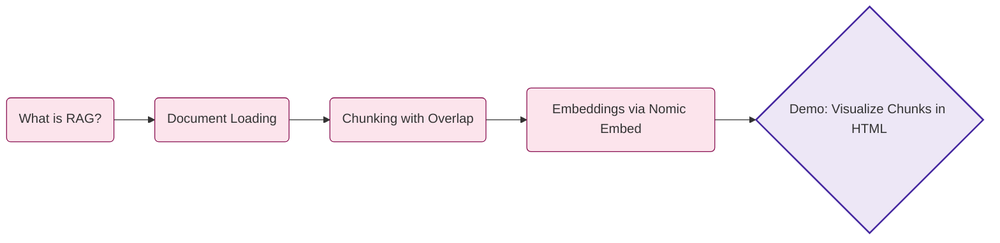

### Chapter 8 Curriculum, Demos & Projects

| Type | Folder / File | Description |
| :---: | :--- | :--- |
| **📄 Document** | `promo_story.txt` | A small narrative document about Promo and The Testing Academy, used as the source corpus for the RAG demo. |
| **🐍 Python** | `rag_chunking.py` | Loads the document, performs sliding-window chunking (300 chars with 50 char overlap), generates embeddings via `nomic-embed-text` on Ollama, prints each chunk + a preview of its 768-dim vector, and writes a styled HTML report. |
| **🌐 HTML** | `chunks_report.html` | A visual, browser-friendly report showing every chunk side by side with its embedding preview — great for understanding what chunking actually looks like. |
| **🧪 Demo** | `Basic_RAG_EXPLAIN/` | End-to-end Basic RAG: ChromaDB + Nomic Embed + Groq, exposed through a small Flask UI. |
| **🧪 Demo** | `Advance_RAG_EXPLAIN/` | Advanced RAG with Qdrant vector store, ingestion pipeline, and a Flask app over the VWO test case corpus. |
| **🚀 Project** | `LangFlows_RAG/` | **RAG over QA Test Case Repository** (LangFlow). Naive RAG with row-level chunking on a 479-TC CSV — generation mode for new TCs from Jira, regression analysis mode with metadata filters. |
| **🚀 Project** | `n8n_Flows_RAG/` | n8n workflows for advanced RAG over a 5,000-TC corpus — alternative orchestration of the same QA RAG use case. |

### Featured Project — RAG over QA Test Case Repository

Located in `Chapter_08_RAG/LangFlows_RAG/`. Builds a RAG system over a QA test case CSV (479 TCs across modules: Reports, Editor, Admin, Mobile, Funnels, AB Testing).

- **Per-row indexing**: 1 test case = 1 chunk + structured metadata (`tc_id`, `jira_id`, `module`, `priority`, `severity`, `labels`, `sprint`, `status`, `owner`).
- **Two retrieval modes**: *Generation* (Jira ID → LLM drafts new TC from K similar exemplars) and *Regression Analysis* (module/priority/sprint query → relevant TCs + gap analysis).
- **Hybrid search**: vector similarity + metadata filters (`module=X`, `status=Active`, `priority IN (P0, P1)`).
- **Outcomes**: 10× faster regression scoping, consistent format for new TCs, natural-language search over a living test repo (no SQL/JQL).

See `Chapter_08_RAG/LangFlows_RAG/README.md` for full architecture, QA value table, and run instructions.

### Prerequisites

1. Install [Ollama](https://ollama.com)
2. Pull the embedding model: `ollama pull nomic-embed-text`
3. Install the Python dependency: `pip install requests`

### Run It

```bash
cd Chapter_08_RAG
python3 rag_chunking.py
# then open chunks_report.html in your browser
```

---

## 📖 Chapter 9: QA Copilot — Multi-Source RAG

**Directory:** `Chapter_09_Project_QACopilot/`

The capstone project of the RAG track. We build a **production-shaped QA Copilot** that retrieves and answers questions across **five heterogeneous QA sources at once** — a Selenium Java framework, a Playwright TypeScript framework, the VWO test case corpus, product PDFs (PRDs), and JIRA bug exports. Each source is its own Qdrant collection; an LLM intent **router** picks 1–2 collections per query; **hybrid retrieval** (BGE-M3 dense + sparse) is fused with RRF; a cross-encoder **reranks** top candidates; Groq `gpt-oss-120b` answers with inline citations. A built-in **RAG Explorer** debugger exposes every pipeline stage.

### Chapter 9 Learning Path

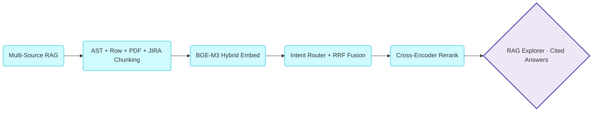

### Chapter 9 Curriculum & Project

| Type | Folder / File | Description |
| :---: | :--- | :--- |
| **🚀 Project** | `Chapter_09_Project_QACopilot/` | **End-to-end QA Copilot** — FastAPI + React + Vite + Tailwind + Qdrant + BGE-M3 + Groq. Five collections, intent routing, hybrid retrieval, rerank, and a RAG Explorer debugger. |
| **📄 KT Doc** | `Chapter_09_Project_QACopilot/KT/index.html` | Standalone HTML knowledge-transfer page: full architecture diagram, component breakdown, chunk schemas, and design trade-offs. |


See `Chapter_09_Project_QACopilot/README.md` for run instructions and `CLAUDE.md` for the architecture deep-dive.

---

## 📖 Chapter 10: MCP Basics — Playwright MCP

**Directory:** `Chapter_10_MCP_Basics/`

This chapter introduces the **Model Context Protocol (MCP)** — an open standard that lets LLMs drive external tools through a uniform interface. We use **Playwright MCP** (`microsoft/playwright-mcp`) to let an AI agent control a real browser: navigate, snapshot accessibility tree, type, click, screenshot, capture errors. The chapter records a hands-on walkthrough against `app.vwo.com` (negative-login scenario) and emits an idiomatic Playwright spec from the captured trace.

### Chapter 10 Learning Path

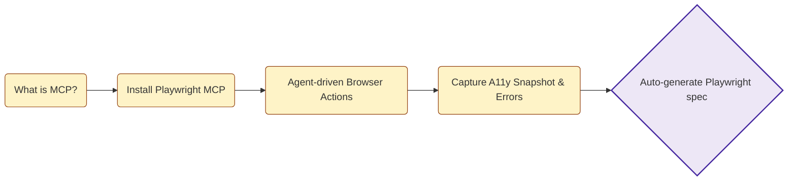

### Chapter 10 Curriculum

| Type | Folder / File | Description |
| :---: | :--- | :--- |
| **📚 Setup** | `Playwright_MCP/Install_MCP.md` | Reference to `github.com/microsoft/playwright-mcp` and install steps for wiring the MCP server into Claude Code / Cursor / VS Code. |
| **🧪 Demo** | `Playwright_MCP/MCP_Usage.md` | Worked example: negative-login on `app.vwo.com` driven entirely through Playwright MCP — `browser_navigate`, `browser_snapshot`, `browser_type`, `browser_click`, `browser_take_screenshot` — and the resulting Playwright test (`tests/vwo-login.spec.ts`) that captures the `Your email, password, IP address or location did not match` error. |
| **🛠️ Build** | `MCP Creation/server.py` | Author your own MCP server with **FastMCP 2.x** — exposes three resources (`resource://greeting`, `data://config`, dynamic `data://user/{user_id}`), one tool (`add`), and two prompt templates (`review_test_case`, `summarize_config`). Runnable over stdio or HTTP. |
| **🛠️ Build** | `MCP Creation/mcp.py` | Minimal starter example with just two resources — the bare-minimum FastMCP file you grow into `server.py`. |

### Playwright MCP Tools (23 total)

`browser_navigate`, `browser_navigate_back`, `browser_snapshot`, `browser_click`, `browser_type`, `browser_fill_form`, `browser_press_key`, `browser_hover`, `browser_drag`, `browser_drop`, `browser_select_option`, `browser_file_upload`, `browser_handle_dialog`, `browser_wait_for`, `browser_evaluate`, `browser_run_code_unsafe`, `browser_take_screenshot`, `browser_console_messages`, `browser_network_request`, `browser_network_requests`, `browser_tabs`, `browser_resize`, `browser_close`.

### Quick Start

```bash
# Install MCP server (one-time)
npx @playwright/mcp@latest --help

# Register in your MCP client (Claude Code / Cursor / VS Code) — see Install_MCP.md
# Then drive the browser from chat:
#   "open app.vwo.com, enter wrong credentials, capture the error"
```

---

### 10.b — MCP Creation (Author Your Own MCP Server with FastMCP)

**Concept:** `FastMCP` is a Python framework that turns plain decorated functions into a Model Context Protocol server — `@mcp.resource` exposes read-only data, `@mcp.tool` exposes callable functions, `@mcp.prompt` exposes reusable prompt templates. Same server can be consumed over stdio (subprocess) or Streamable HTTP.

**Why:** Playwright MCP shows you how to *use* an MCP server. This module shows you how to *build* one — so your own internal QA helpers (test-case lookups, log searchers, env probes) become first-class tools any LLM client can call.

**Q&A — why use this?**
- **Q: Why not just expose a REST API?** A: MCP gives you tools + resources + prompts + cancellation + streaming over one framed protocol with a standard discovery handshake — every MCP-aware client (Claude Code, Cursor, Inspector) auto-discovers your capabilities. REST gives you none of that.
- **Q: Why does the file have to be named `server.py` and not `mcp.py`?** A: `mcp.py` shadows the `mcp` PyPI package that FastMCP imports internally, breaking `fastmcp run` with `No server object found`. Always pick a non-shadowing filename.
- **Q: Stdio vs HTTP — which should I use?** A: Stdio when the client spawns the server as a child process (Claude Code MCP config). HTTP when multiple clients share one long-lived server or you want to debug with curl / Inspector over the network.

```mermaid
flowchart LR
    A[server.py<br/>@mcp.resource<br/>@mcp.tool<br/>@mcp.prompt] --> B{fastmcp run}
    B -->|--transport stdio| C[MCP Inspector<br/>spawns child]
    B -->|--transport http<br/>--port 8765| D["http://127.0.0.1:8765/mcp"]
    C --> E[Discover · Call · Read]
    D --> E
    E --> F[LLM client<br/>Claude Code · Cursor · Inspector]

    style A fill:#fef3c7,stroke:#92400e
    style B fill:#cffafe,stroke:#06b6d4
    style C fill:#e8f5e9,stroke:#2e7d32
    style D fill:#e8f5e9,stroke:#2e7d32
    style F fill:#ede7f6,stroke:#4527a0,stroke-width:2px
```

```python
# server.py — resources + tool + prompts in one file
import json
from fastmcp import FastMCP

mcp = FastMCP(name="DataServer")

@mcp.resource("data://config")
def get_config() -> str:
    return json.dumps({"theme": "dark", "version": "1.2.0"})

@mcp.resource("data://user/{user_id}")
def get_user(user_id: str) -> str:
    return json.dumps({"id": user_id, "name": f"User {user_id}", "role": "tester"})

@mcp.tool
def add(a: int, b: int) -> int:
    """Add two integers and return the sum."""
    return a + b

@mcp.prompt
def review_test_case(test_case: str) -> str:
    return f"You are a senior QA reviewer. Review:\n\n{test_case}"

if __name__ == "__main__":
    mcp.run()
```

**Run + debug:**

```bash
# Stdio (Inspector spawns it)
npx @modelcontextprotocol/inspector \
  fastmcp run "Chapter_10_MCP_Basics/MCP Creation/server.py:mcp"

# HTTP (long-lived, share between clients)
fastmcp run "Chapter_10_MCP_Basics/MCP Creation/server.py:mcp" \
  --transport http --host 127.0.0.1 --port 8765
# → http://127.0.0.1:8765/mcp
```

| Decorator | Purpose | Discovery method |
| :--- | :--- | :--- |
| `@mcp.resource("uri://...")` | Read-only data (static or templated) | `resources/list` + `resources/read` |
| `@mcp.tool` | Callable function with typed args | `tools/list` + `tools/call` |
| `@mcp.prompt` | Parametrised prompt template | `prompts/list` + `prompts/get` |

---

## 📖 Bonus: Chapter 6 & 7 — AI Agents

| Chapter | Directory | What's inside |
| :---: | :--- | :--- |
| **Ch 6** | `Chapter_06_AI_Agents_LangFlow/` | Exported LangFlow JSON flows — *QA Buddy* agent and a *Bug Report Classifier & Prioritizer* agent. |
| **Ch 7** | `Chapter_07_AI_Agent_VIBE_Coding/` | Vibe-coded **JIRA AI Agent** (frontend + backend + templates) plus a *Test Case Generator from User Stories* flow. |

---

## 📖 Bonus: Postman MCP — AI-Generated API Collections

This repo also demonstrates **Postman MCP** — using the Postman Model Context Protocol server to let an AI agent build production-grade Postman collections (requests, variables, scripts, assertions) directly inside a Postman workspace, with zero manual clicking.

### Workspace

All collections live in the **`ATB2X Demo`** Postman workspace (`b4d9ec74-5bb8-4f5b-89bd-d1c13caea874`).

### Collections Generated via Postman MCP

| # | Collection | Endpoints | Tests / Request | Highlights |
| :---: | :--- | :---: | :---: | :--- |
| 1 | **Zippopotam India - 560066** | 1 | 4 | Smoke check against `api.zippopotam.us/in/560066` — country, post-code, and places-array assertions. |
| 2 | **Restful Booker - Full API** | 10 | 11–15 | Full CRUD lifecycle against `restful-booker.herokuapp.com` — Ping, Auth, GetBookingIds (all + filter), GetBooking, CreateBooking, UpdateBooking (PUT), PartialUpdateBooking (PATCH), DeleteBooking, plus a 404 verification step. Token + bookingId chained through collection variables. |

### Restful Booker — Run Order

```
01 Ping  →  02 Auth (saves token)  →  06 CreateBooking (saves bookingId)
       →  03 / 04 / 05 (reads)
       →  07 PUT  →  08 PATCH  →  09 DELETE  →  10 Verify 404
```

### Assertion Patterns Used

- HTTP status code + status text
- Response-time SLA (`< 3000ms`, `< 5000ms` for list endpoints)
- `Content-Type` header presence and value
- JSON schema + field type checks (`string`, `number`, `boolean`, array shape)
- Request ↔ response value parity (e.g., `firstname` echoed back)
- Regex date format (`YYYY-MM-DD`) and date logic (`checkout >= checkin`)
- Duplicate-ID detection across list responses
- Collection-variable persistence (`token`, `bookingId`) across requests
- Negative path (404 after delete)

### Why Postman MCP

- **No clicking** — the LLM emits a v2.1.0 collection JSON; the MCP server materialises it in your workspace.
- **Repeatable** — same prompt regenerates identical collections; great for teaching and demos.
- **Test-rich by default** — every request ships with 10+ `pm.test` assertions instead of an empty stub.
- **Chained state** — variables (`token`, `bookingId`) flow between requests, so the collection is runnable end-to-end via Collection Runner / Newman.

---

## 📖 Chapter 11: Python Learning Fundamentals

**Directory:** `Chapter_11_Python_Learning/`

A self-paced Python primer for QA engineers. Each file is a standalone, runnable lesson with inline comments and a quick-reference table at the bottom.

### Chapter 11 Learning Path

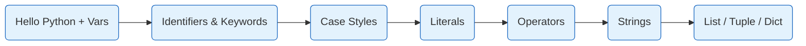

### Files

| # | File | Topic |
| :---: | :--- | :--- |
| 01 | `01_Hello_Python.py` | First `print`, running a `.py` file |
| 02 | `02_Basic.py` | Variables, types (str, int, float, bool, None) |
| 03 | `03_Basic2.py` | Type conversions, input/output |
| 04 | `04_AIAGent_Query.py` | Calling an LLM from Python |
| 05 | `05_Identifier.py` | Identifier rules — allowed chars, no spaces, no `$`/`-`/`.`, PEP 8 |
| 06 | `06_Keyword.py` | Reserved keywords via `keyword.kwlist` |
| 07 | `07_Case.py` | snake_case, PascalCase, camelCase, kebab-case, dunder |
| 08 | `08_Literals.py` | int/float/complex, strings (raw/f-string/bytes), bool, None, collections |
| 09 | `09_Operators.py` | Arithmetic, logical, bitwise, identity, membership, ternary, precedence table |
| 10 | `10_Strings.py` | Full string-method reference (case, trim, search, split/join, format) |
| 11 | `11_List_Tuple_Dict.py` | Collection methods with QA examples |
| 12 | `12_Tuple.py` | Tuple immutability demo |

---

## 📖 Chapter 12: TestCase MCP — Expose Your Test Suite to Any LLM

**Directory:** `Chapter_12_MCP_Creation/`

A local **FastMCP** server (`tc_mcp.py`) that wraps a 478-row VWO test case CSV and exposes it as MCP tools, resources, and prompts. Any MCP-compatible client (Claude Desktop, Cursor, Claude Code, MCP Inspector) can connect over stdio and search, filter, fetch, or **create** test cases in natural language.

### Chapter 12 Architecture

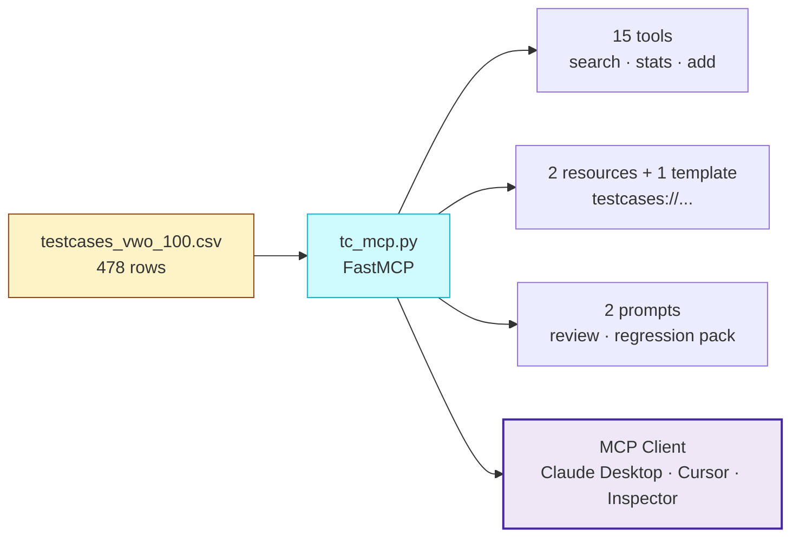

### What it exposes

| Type | Items | Notes |
| :--- | :--- | :--- |
| **Tools (15)** | `list_test_cases`, `get_test_case`, `search_by_priority`, `search_by_module`, `search_by_label`, `search_by_owner`, `search_by_status`, `search_by_sprint`, `search_test_cases` (multi-filter + free text), `list_priorities / modules / labels / owners`, `stats`, `add_test_case` (write — persists to CSV) | All filters AND-combined; auto-id `TC-00###` on add |
| **Resources** | `testcases://all`, `testcases://stats`, `testcases://{test_case_id}` | Browsable read-only data |
| **Prompts** | `review_test_case`, `suggest_regression_pack` | Reusable LLM instructions |

### Run + inspect

```bash
cd Chapter_12_MCP_Creation
python3 -m venv venv && source venv/bin/activate
pip install fastmcp
python tc_mcp.py                                         # stdio
npx @modelcontextprotocol/inspector ./venv/bin/python ./tc_mcp.py
# Inspector: http://localhost:6274
```

See [`Chapter_12_MCP_Creation/README.md`](Chapter_12_MCP_Creation/README.md) for Claude Desktop / Cursor / Claude Code configs and [`PROMPT.md`](Chapter_12_MCP_Creation/PROMPT.md) for the original build prompts and lesson recap.

---

## 📖 Chapter 13: Multi-Agent QA with CrewAI

**Directory:** `Chapter_13_CREW_AI_Agent/`

Three progressively-richer **CrewAI** examples that show how to assemble specialist QA agents (analyst, researcher, writer, triage, root-cause, test strategy) on top of **GPT-OSS 120B** running on Groq. Includes a live **Jira integration** that pulls bugs straight from `atlassian.net`.

### Chapter 13 Agent Flow

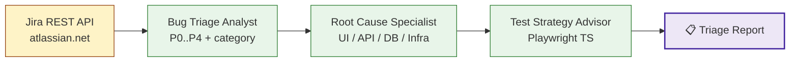

### Examples

| # | File | What it does |
| :---: | :--- | :--- |
| 01 | `01_Test_Analyst_Agent.py` | Single agent — senior QA generates 5–10 test cases for the VWO login page. |
| 02 | `02_Research_Write_AI_Agent.py` | Two sequential agents — researcher surfaces the top-5 bug categories, writer turns them into a PR-time prevention checklist. |
| 03 | `03_Building_QABugTriageCrew.py` | Three agents + Jira API — fetches a real ticket, triages it (severity, category), runs RCA, recommends Playwright tests. |

### Setup

`.env` (inside `Chapter_13_CREW_AI_Agent/`):

```
GROQ_KEY=gsk_xxxxx
JIRA_EMAIL=you@example.com
JIRA_API_TOKEN=xxxxx
```

> `.env` is gitignored (`**/.env`). Never paste API keys into chat or commits — rotate immediately if leaked.

```bash
cd Chapter_13_CREW_AI_Agent
python3 -m venv venv && source venv/bin/activate
pip install crewai python-dotenv requests
venv/bin/python 01_Test_Analyst_Agent.py
venv/bin/python 02_Research_Write_AI_Agent.py
venv/bin/python 03_Building_QABugTriageCrew.py
```

### Notes / gotchas

- **Model id:** `openai/openai/gpt-oss-120b` — the leading `openai/` tells LiteLLM to route through the OpenAI provider; `openai/gpt-oss-120b` is Groq's actual model id.
- **CrewAI 1.14.6 `cache_breakpoint` bug:** Groq's OpenAI-compatible endpoint rejects a `cache_breakpoint` field that CrewAI injects. All three scripts subclass `LLM` → `GroqLLM` and strip the field before every call.

---

## 📖 Chapter 14: CrewAI + Jira MCP — Auto QA Pipeline

**Directory:** `Chapter_14_Crew_AI_QA_Pipeline/`

A 4-agent CrewAI pipeline that turns a single Jira ticket ID into a complete QA package:

| Agent | Output |
| :--- | :--- |
| **Senior QA Analyst** | Reads ticket from Jira via MCP (`uvx mcp-atlassian`), extracts requirements / AC / edge cases |
| **Test Plan Writer** | 12-section markdown test plan → `output/test_plan.md` |
| **Test Case Designer** | 12-15 detailed test cases in a markdown table → `output/test_cases.md` |
| **Playwright Coder** | TypeScript test scripts → `output/playwright_tests.md` |

### Ch 14 Flow

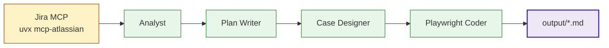

### Run

```bash
cd Chapter_14_Crew_AI_QA_Pipeline
python3 -m venv venv && source venv/bin/activate
pip install crewai "crewai-tools[mcp]" mcp python-dotenv litellm requests
# .env: GROQ_KEY=...  JIRA_URL=https://<workspace>.atlassian.net  JIRA_EMAIL=...  JIRA_API_TOKEN=...
venv/bin/python main.py VWO-48
```

### Notes / gotchas

- **TPM budget:** `mcp-atlassian` exposes ~49 tools. Each tool schema bloats the system prompt. Tools are filtered to `{jira_get_issue, jira_search}` to stay under Groq's 8,000 TPM cap.
- **Model:** runs on `openai/llama-3.3-70b-versatile` (30 k TPM on Groq free tier). Swap to `openai/openai/gpt-oss-120b` if you upgrade.
- Same `cache_breakpoint` workaround as Chapter 13.

---

## 📖 Chapter 15: Production QA Pipeline — Templates, CSV, Framework, UI

**Directory:** `Chapter_15_CREW_AI_production_QA_pipeline/`

Production-ready evolution of Chapter 14. Same 4-agent crew, but the outputs are now structured for real downstream use, and a lightweight web UI lets you fan it out across multiple tickets.

### What's different from Ch 14

| Concern | Ch 14 | Ch 15 |
| :--- | :--- | :--- |
| Test plan template | Inline string in `crew.py` | Externalised → `templates/testplan.md` |
| Test case output | Markdown table → `test_cases.md` | **Jira-import CSV** → `test_cases.csv` (Highest/High/Medium/Low priority, wiki markup description, quoted multi-line cells) |
| Playwright output | Single markdown file | **Multi-file Advanced Playwright Framework** → `output/advanced-playwright-framework/src/{pages,modules,tests,fixtures,testdata}/` |
| Interface | CLI only | CLI + **Starlette UI** (`ui/app.py`) for multi-ticket fan-out |
| Multi-ticket | Manual loops | UI textarea → sequential runs → per-ticket snapshot in `runs/<TICKET>/` |

### Ch 15 Architecture

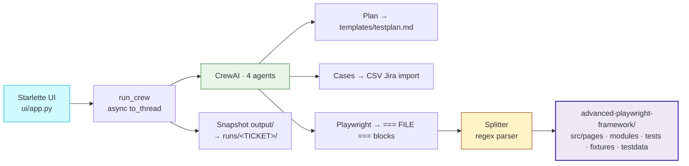

### Folder layout

```
Chapter_15_CREW_AI_production_QA_pipeline/
├── crew.py                       # pipeline + post-process file splitter
├── main.py                       # CLI entrypoint
├── templates/
│   └── testplan.md               # extracted plan template
├── docs/
│   └── ARCHITECTURE.html         # Advanced Playwright Framework spec
├── ui/
│   ├── app.py                    # Starlette + Jinja2 ASGI app
│   └── templates/
│       ├── index.html            # textarea form
│       └── results.html          # folder tree + CSV table + MD pane
├── output/                       # latest run (gitignored)
├── runs/<TICKET>/                # per-ticket snapshots (gitignored)
└── PROMPTS.md                    # every prompt used to build this chapter
```

### Run the UI

```bash
cd Chapter_15_CREW_AI_production_QA_pipeline
python3 -m venv venv && source venv/bin/activate
pip install crewai "crewai-tools[mcp]" mcp python-dotenv litellm requests \
            uvicorn starlette jinja2 python-multipart
venv/bin/python -m uvicorn ui.app:app --host 127.0.0.1 --port 8000 --reload
# → http://127.0.0.1:8000/  (paste one or many Jira IDs)
```

### Run from CLI

```bash
venv/bin/python main.py VWO-48
```

### Key engineering notes

- **Agent 4 output protocol:** the Playwright agent emits literal blocks
  `=== FILE: <relpath> === ... === END FILE ===`. A regex in `crew.py`
  (`_FILE_BLOCK`) parses them and writes each block into
  `output/advanced-playwright-framework/<relpath>`, auto-creating subdirs.
  Stray ` ```ts ` fences are stripped.
- **Async-safe execution:** CrewAI's sync `crew.kickoff()` refuses to run
  inside an active asyncio loop. The Starlette handler calls
  `await asyncio.to_thread(run_crew, ticket)` so the sync pipeline runs in
  a worker thread.
- **CSV format:** header is `Summary,Issue Type,Priority,Labels,Components,Description,Reporter,Assignee`. Priority maps P0→Highest, P1→High, P2→Medium, P3→Low. `Description` uses Jira wiki markup (`h3. Preconditions / Steps / Expected Result / Test Data / Category`) so it imports cleanly into a Jira project.
- See [`Chapter_15_CREW_AI_production_QA_pipeline/PROMPTS.md`](Chapter_15_CREW_AI_production_QA_pipeline/PROMPTS.md) for every prompt that drove the build.

---

## 📖 Chapter 16: DeepEval — Quality Metrics for LLM Pipelines (work in progress)

**Directory:** `Chapter_16_DeepEval/`

Uses the [DeepEval](https://github.com/confident-ai/deepeval) framework to **measure** the quality of outputs produced by the Chapter 14 / 15 CrewAI pipelines — test plans, test cases, generated Playwright code. Metrics: faithfulness, answer relevancy, hallucination, contextual precision/recall, and custom G-Eval rubrics for QA artefacts.

### Setup

```bash
cd Chapter_16_DeepEval
python3 -m venv venv && source venv/bin/activate
pip install deepeval requests
```

### Files

| File | Purpose |
| :--- | :--- |
| `SKILL.md` | Tiered-model-orchestration skill (orchestrator on Opus/Fable, subagents on Sonnet/Haiku) — used to keep evaluation runs cheap |

> Fine-tuning content moved to [Chapter 17](#-chapter-17-fine-tuning-open-source-models-on-your-own-data) so this chapter stays focused on evaluation. Hands-on DeepEval exercises live in [Chapter 18](#-chapter-18-deepeval-exercises--llm-as-judge-evaluation).

---

## 📖 Chapter 17: Fine-Tuning Open-Source Models on Your Own Data

**Directory:** `Chapter_17_Fine_Tuning/`

Take a free, open-source LLM (Qwen2.5-Coder, Llama 3, Mistral, Phi, ...) and adapt it to your own knowledge — a **code repository**, a **Jira project**, a stack of **PDFs**, internal wikis, chat transcripts, anything. Bot then answers in your voice against your facts, fully on your machine.

### What you can fine-tune against

| Source | Example use |
| :--- | :--- |
| **Code repo** | "How does `LoginModule` call `LoginPage`?" |
| **Jira project** | "List unresolved P0 bugs in Reports module from sprint 25.S38." |
| **PDF library** | "What does our security playbook say about API token rotation?" |
| **Confluence / wiki** | "What is our standard test plan template?" |
| **Slack / chat logs** | "What did the team decide about the discount-code bug?" |
| **Test case CSVs** | "Show regression tests owned by `aditya.rao` in the Editor module." |
| **Training videos** (Whisper transcripts) | "When in the onboarding video do they show staging credentials?" |
| **OpenAPI / Postman** | "Generate a Playwright API test for `POST /booking` with full assertions." |

### RAG vs LoRA

| Approach | Weights changed? | Compute | When |
| :--- | :--- | :--- | :--- |
| **RAG** | No | CPU | Facts that change often; start here |
| **LoRA / QLoRA** | Yes (small adapter) | GPU / Apple Silicon (MLX) | Bake in tone / domain jargon |
| **Full fine-tune** | Yes (all weights) | Multi-GPU cluster | Almost never the right choice |

### Stack

Ollama (`qwen2.5-coder:14b` + `nomic-embed-text`) → LanceDB / Chroma vector store → Python glue (`index_repo.py`, `ask.py`). Optional LoRA via MLX-LM (Mac) or Unsloth (CUDA). Everything offline.

See [`Chapter_17_Fine_Tuning/README.md`](Chapter_17_Fine_Tuning/README.md) and [`Fine_TUNE_Instructions.md`](Chapter_17_Fine_Tuning/Fine_TUNE_Instructions.md) for the full Qwen2.5-Coder + Ollama recipe.

---

## 📖 Chapter 18: DeepEval Exercises — LLM-as-Judge Evaluation

**Directory:** `Chapter_18_DeepEval/`

Hands-on exercises with the [DeepEval](https://github.com/confident-ai/deepeval) evaluation framework. Each test sends a real prompt to a real LLM, then a **separate judge LLM** scores the answer using metrics like `AnswerRelevancyMetric` and `HallucinationMetric`. Push optional to the Confident AI dashboard for history + drift tracking.

### Setup

```bash
cd Chapter_18_DeepEval
python3 -m venv venv && source venv/bin/activate
# deepeval 4.0.6 has a packaging bug ("No module named 'deepeval.deepeval'");
# pin to <4 for now.
pip install "deepeval<4" requests openai python-dotenv
```

`.env.local` (gitignored — never commit) keys:

```
OPENAI_API_KEY=sk-...
GROQ_API_KEY=gsk_...
OPENROUTER_API_KEY=sk-or-v1-...
CONFIDENT_API_KEY=confident-...     # optional, only if pushing to the cloud dashboard
```

### Exercises

| File | Model under test | Judge | What it teaches |
| :--- | :--- | :--- | :--- |
| `exercises/test_01_Basic_Anwser_Relevancy.py` | hard-coded answer string | default (OpenAI) | The two foundational metrics — AnswerRelevancy + Hallucination. `LLMTestCase` shape, `assert_test`, the `context=[...]` requirement for Hallucination. |
| `exercises/test_02_Groq_Llama4_vs_GPT41_Judge.py` | Groq `meta-llama/llama-4-scout-17b-16e-instruct` | OpenAI `gpt-4.1` | Real Groq call via OpenAI-compatible endpoint; pass `model="gpt-4.1"` to each metric to choose the judge. |
| `exercises/test_03_OpenRouter_Llama4_vs_GPT41_Judge.py` | OpenRouter `meta-llama/llama-4-scout` | OpenAI `gpt-4.1` | Same shape as Exercise 2, but via the OpenRouter gateway — shows how easy it is to swap providers (only base URL, model id, key change). |

All three follow the same pattern:


### Run a single test

```bash
deepeval test run exercises/test_02_Groq_Llama4_vs_GPT41_Judge.py -d all -v
```

DeepEval requires the `test_` filename prefix; that's why Exercise 1 was renamed from `01_*` to `test_01_*`.

### Gotchas already worked through

- **deepeval 4.0.6 packaging bug:** internal `deepeval.deepeval` import is missing. Pin `deepeval<4`.
- **`HallucinationMetric` needs `context=[...]`** on the `LLMTestCase`, otherwise it throws.
- **macOS DNS cache:** Python's `getaddrinfo()` can keep a stale negative entry for `api.confident-ai.com`. Fix once with `sudo dscacheutil -flushcache && sudo killall -HUP mDNSResponder`.
- **Push to Confident AI:** set `CONFIDENT_API_KEY` in `.env.local`; `deepeval test run` auto-uploads when present.

---

## 📖 Chapter 19: DeepEval Framework — Evaluating a Real Chatbot + RAG System

**Directory:** `Chapter_19_DeepEval_Framework/`

A full, end-to-end evaluation harness built around two **real, runnable apps under test** and a switchable LLM-as-judge framework. Where Chapter 18 evaluates single prompts, Chapter 19 evaluates **live production-shaped systems** — a customer-support chatbot and a complete RAG pipeline — using DeepEval metrics for relevancy, faithfulness, grounding, hallucination, bias, and toxicity.

Three subsystems:

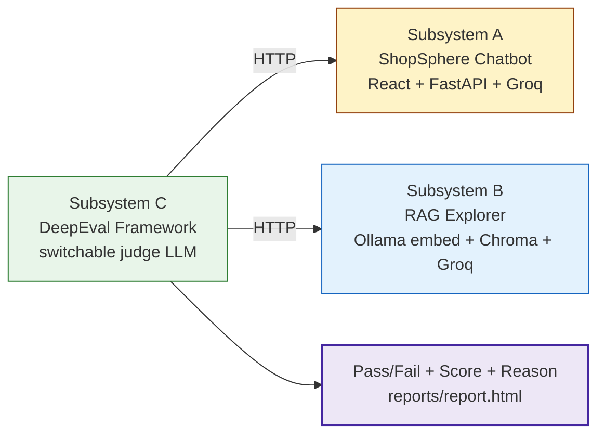

### Subsystem A — `01_Chatbot/` ShopSphere E-commerce Chatbot

React (Vite) frontend + FastAPI backend + Groq LLM (`llama-3.3-70b-versatile`). The "app under test."

| Service | Port |
|---------|------|
| FastAPI backend | 8201 |
| Vite dev server | 5173 |

```bash
# Terminal 1 — backend
cd 01_Chatbot/shopeasy_chatbot/01_chatbot/backend
python3 -m venv venv && source venv/bin/activate
pip install -r requirements.txt
export GROQ_API_KEY=gsk_...
uvicorn app:app --reload --port 8201

# Terminal 2 — frontend
cd 01_Chatbot/shopeasy_chatbot/01_chatbot/frontend
npm install && npm run dev
```

Open <http://localhost:5173>. Without `GROQ_API_KEY` it falls back to mock mode. API: `GET /health`, `POST /chat`.

### Subsystem B — `02_RAG_Explorer/` RAG Explorer

A complete, locally-runnable RAG pipeline that **exposes every stage** — raw chunks, embeddings model, retrieved hits with scores, and the grounded answer — so retrieval, faithfulness, and grounding can be audited.

```
ingest → chunk → embed (nomic-embed-text via Ollama) → store (ChromaDB) → retrieve → answer (Groq)
```

Port `8202`. Prerequisites: Ollama with `nomic-embed-text` pulled, and `GROQ_API_KEY` for live answers (mock mode works without it).

```bash
cd 02_RAG_Explorer/02_rag_explorer
python3 -m venv venv && source venv/bin/activate
pip install -r requirements.txt
ollama pull nomic-embed-text
export GROQ_API_KEY=gsk_...
uvicorn app:app --reload --port 8202
```

Open <http://localhost:8202>. Pages: `/` dashboard, `/ingest` (seed bundled corpus + upload PDF/MD/TXT), `/search` (pure retrieval with ranked hits), `/chat` (full RAG with the retrieval panel exposed). Bundled corpus: 5 e-commerce knowledge files (refund, shipping, return policies, product catalog, FAQ).

### Subsystem C — `03_DeepFramework/` DeepEval Framework

The evaluation harness that points DeepEval metrics at the two live apps. **Switchable judge LLM** via `JUDGE_PROVIDER` — the same `CompatibleJudge` class works for all three because OpenAI, Groq, and Ollama expose an OpenAI-compatible endpoint (`instructor` handles structured output uniformly):

- `openai` → `OPENAI_API_KEY`, `gpt-4o-mini` (override `JUDGE_MODEL_OPENAI`)
- `groq` → `GROQ_API_KEY`, `openai/gpt-oss-120b` (override `JUDGE_MODEL_GROQ`)
- `ollama` → local Ollama at `http://localhost:11434/v1`, `gpt-oss:20b` (override `JUDGE_MODEL_OLLAMA`)

**Two ways to run the same metric registry** (one source of truth in `dashboard/registry.py` — 22 metric × target rows):

```bash
cd 03_DeepFramework
python3 -m venv venv && source venv/bin/activate
pip install -r requirements.txt
# Subsystems A (:8201) and B (:8202) must be running first; .env is auto-loaded

# 1) pytest — CI-style, per-golden cases
export JUDGE_PROVIDER=openai          # or groq / ollama
pytest tests/test_01_chatbot_answer_relevancy.py -v

# 1b) push results to the Confident AI cloud dashboard
deepeval test run tests/test_01_chatbot_answer_relevancy.py   # needs CONFIDENT_API_KEY

# 2) interactive local dashboard on :8203 — click any metric, live pass/fail/score/reason
uvicorn dashboard.app:app --port 8203
open http://localhost:8203
```

| Piece | What |
|-------|------|
| `conftest.py` | loads `.env`, builds the judge from `JUDGE_PROVIDER`, exposes `chatbot` / `rag` / `judge` / golden fixtures, auto-skips when a target app is down |
| `pytest.ini` | markers (`chatbot`, `rag`, `quality`, `safety`, `slow`, `needs_chatbot`, `needs_rag`) |
| `dashboard/` | FastAPI app (`:8203`) that drives the registry interactively + switches judge provider live |
| `datasets/` | `chatbot_goldens.py` (19 goldens + 13 safety prompts), `rag_goldens.py` (8 goldens) |
| `llm_providers/` | `CompatibleJudge` + `JUDGE_PROVIDER` factory |
| `targets/` | HTTP clients for the chatbot and RAG apps |

| Scoring direction | Metrics |
|-------------------|---------|
| Higher is better (threshold = floor) | answer relevancy, faithfulness, contextual precision/recall/relevancy, summarization, G-Evals, conversation relevancy |
| Lower is better (threshold = ceiling) | hallucination, bias, toxicity, PII leakage |

> **deepeval pinned to `3.9.9`.** The latest release (`4.0.6`) ships a broken `deepeval test run` CLI (`from deepeval.deepeval.config.settings import ...` — a typo in their package; the library itself works fine). `3.9.9` is the last release whose CLI works out of the box and still has every metric the registry uses (incl. `PIILeakageMetric`, `KnowledgeRetentionMetric`, `ConversationCompletenessMetric`).

### Notes

- Each `.env` is gitignored — never commit real keys. Set `GROQ_API_KEY` / `OPENAI_API_KEY` / `CONFIDENT_API_KEY` per subsystem.
- The chatbot and RAG apps were verified live: chatbot answers shipping/returns questions via Groq; RAG seeds 21 chunks from 5 docs and returns grounded, source-cited answers.
- The dashboard was verified end-to-end against both apps (e.g. `chatbot.answer_relevancy` → 1.0 pass, `rag.contextual_recall` → 1.0 pass) with the Groq and OpenAI judges.
- **Judge rate limits:** Groq's free tier caps `gpt-oss-120b` at 8000 TPM, which `deepeval test run` can exceed when it fans out judge calls. Use the OpenAI judge (`JUDGE_PROVIDER=openai`, `gpt-4o-mini`) for large runs.

---

*Continue following this repository for future chapters exploring deeper AI integrations!*
