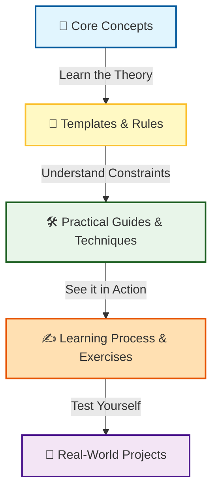
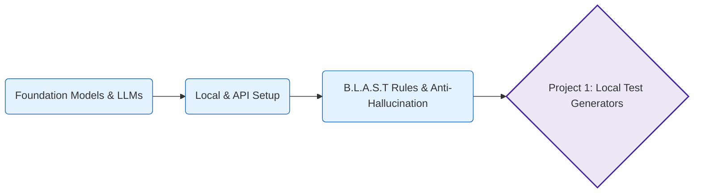
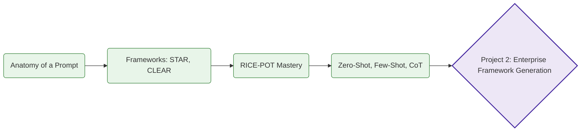
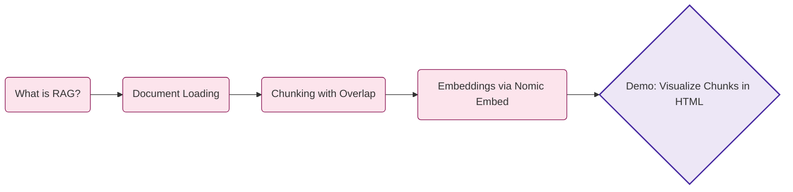
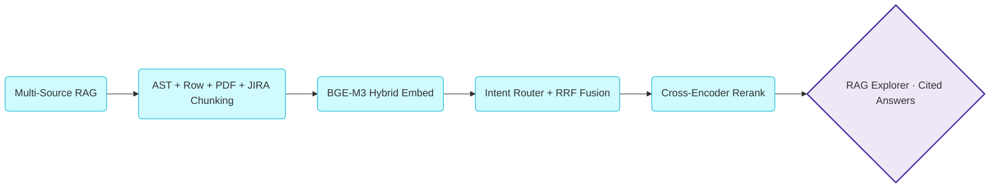
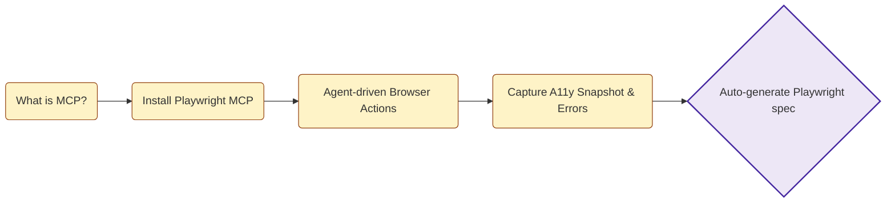

# Automation Desktop Blueprint by 2x - SDET Course

Welcome to the **Automation Desktop Blueprint by 2x** repository! This project serves as a comprehensive guide to understanding and integrating Artificial Intelligence (AI) and Large Language Models (LLMs) into modern software testing and Quality Assurance (QA) workflows.

The repository is structured systematically into chapters, covering theoretical concepts, practical exercises, and real-world projects to take you from fundamentals to advanced AI-assisted test automation.

---

## 🗺️ Course Learning Flow

To get the most out of this repository, we recommend following this progressive workflow for each chapter:



1. **`core_concepts/`**: Start here. Read these markdown files to build your foundational knowledge and terminology.
2. **`rules_checklists/` & `templates/`**: Utilize reusable templates and strict rules (e.g., Anti-Hallucination guidelines, B.L.A.S.T.) to enforce consistency in your AI interactions.
3. **`practical_guides/` & `techniques/`**: Explore these folders for step-by-step tutorials and prompt strategies (like RICE-POT).
4. **`learning_practice/`**: Engage in hands-on, self-directed exercises (and refer to the solutions) to reinforce your learning.
5. **`Project_.../`**: Synthesize and apply everything you have learned to comprehensive testing challenges and enterprise frameworks.

---

## 📖 Chapter 1: LLM Basics

**Directory:** `Chapter_01_LLM_BASICS/`

In this foundational chapter, we explore the basics of Large Language Models (LLMs) and how to leverage them (both local and cloud-based APIs) for generating reliable test automation scripts. We establish critical guardrails like the Anti-Hallucination rules and the B.L.A.S.T. master system prompt to prevent AI drift or fabricated outputs.

### Chapter 1 Learning Path



### Chapter 1 Curriculum & Projects

| Type | Folder / Module | Description |
| :---: | :--- | :--- |
| **📚 Learning** | `core_concepts/` | Architectural fundamentals of Foundation Models and LLM definitions. |
| **📚 Learning** | `practical_guides/` | Practical guidance on setting up and interacting with LLMs locally and via APIs (such as Groq API). |
| **📚 Learning** | `rules_checklists/` | Critical guardrails including the Anti-Hallucination rule-sets and the B.L.A.S.T. framework. |
| **📚 Learning** | `learning_practice/` | Foundational exercises to practice basic LLM interaction skills and test prompt behavior. |
| **🚀 Project** | `Project_01_LocalLLMTestGenerator` | **Standalone App**: Building a standard, self-contained local application for generating tests using local models. |
| **🚀 Project** | `Project_01_LocalLLMTestGenerator_Antigravity` | **Agentic Architecture**: A specialized test generator built using an advanced agentic system (Antigravity). |
| **🚀 Project** | `LocalLLMTestGenBuddy` | **Submodule Component**: A reusable codebase component utilized for assisting local test generation contexts. |

---

## 📖 Chapter 2: Prompt Engineering

**Directory:** `Chapter_02_PROMPT_ENGINEERING/`

This chapter dives deep into the art and science of **Prompt Engineering** tailored specifically for automation engineers. We introduce vital prompt frameworks—like **RICE-POT** (Role, Instructions, Context, Example, Parameters, Output, Tone)—and use advanced techniques to generate enterprise-grade automation frameworks, ensuring strict compliance with production-level standards.

### Chapter 2 Learning Path



### Chapter 2 Curriculum & Projects

| Type | Folder / Module | Description |
| :---: | :--- | :--- |
| **📚 Learning** | `core_concepts/` | The core anatomy of prompts and overviews of standard frameworks like STAR, CLEAR, and CRISP. |
| **📚 Learning** | `techniques/` | Deep-dives into advanced QA techniques: Few-Shot, Chain-of-Thought, Zero-Shot, and Role-playing. |
| **📚 Learning** | `practical_guides/` | Step-by-step practical guides to writing effective QA and automation instructions from scratch. |
| **📚 Learning** | `learning_practice/` | Hands-on prompt engineering exercises with detailed, documented solutions for practical mastery. |
| **🚀 Project** | `Project_02_Prompt_Templates` | **Template Engine**: A repository containing reusable, high-quality prompt templates specifically designed for QA Tasks (e.g., API testing, Bug Reports). |
| **🚀 Project** | `Project_02_REAL_PROJECT_PE` | **Test Planning via LLMs**: Applying prompt engineering to ingest a real-world product context (VWO Platform) to auto-generate thorough Test Plans. |
| **🚀 Project** | `Project_02_RICE_POT_Selenium_FW` | **Framework Generation**: Using the RICE-POT framework to completely architect and generate an enterprise-grade Selenium TestNG Page Object Model. |
| **🚀 Project** | `Project_03_RICE_POT_Playwright_Advance_FQ` | **Advanced UI Testing**: Extending prompt engineering capabilities to architect and build robust end-to-end modern testing solutions using Playwright. |

---

## 📖 Chapter 8: Retrieval Augmented Generation (RAG)

**Directory:** `Chapter_08_RAG/`

In this chapter, we introduce **Retrieval Augmented Generation (RAG)** — the technique that grounds an LLM in your own documents instead of relying purely on its training data. We start with the most important building block of any RAG pipeline: **chunking and embeddings**. Using a small story document about *Promo and The Testing Academy*, we split the text into overlapping chunks and convert each chunk into a 768-dimensional vector using the **Nomic Embed** model running locally through **Ollama**.

### Chapter 8 Learning Path



### Chapter 8 Curriculum, Demos & Projects

| Type | Folder / File | Description |
| :---: | :--- | :--- |
| **📄 Document** | `promo_story.txt` | A small narrative document about Promo and The Testing Academy, used as the source corpus for the RAG demo. |
| **🐍 Python** | `rag_chunking.py` | Loads the document, performs sliding-window chunking (300 chars with 50 char overlap), generates embeddings via `nomic-embed-text` on Ollama, prints each chunk + a preview of its 768-dim vector, and writes a styled HTML report. |
| **🌐 HTML** | `chunks_report.html` | A visual, browser-friendly report showing every chunk side by side with its embedding preview — great for understanding what chunking actually looks like. |
| **🧪 Demo** | `Basic_RAG_EXPLAIN/` | End-to-end Basic RAG: ChromaDB + Nomic Embed + Groq, exposed through a small Flask UI. |
| **🧪 Demo** | `Advance_RAG_EXPLAIN/` | Advanced RAG with Qdrant vector store, ingestion pipeline, and a Flask app over the VWO test case corpus. |
| **🚀 Project** | `LangFlows_RAG/` | **RAG over QA Test Case Repository** (LangFlow). Naive RAG with row-level chunking on a 479-TC CSV — generation mode for new TCs from Jira, regression analysis mode with metadata filters. |
| **🚀 Project** | `n8n_Flows_RAG/` | n8n workflows for advanced RAG over a 5,000-TC corpus — alternative orchestration of the same QA RAG use case. |

### Featured Project — RAG over QA Test Case Repository

Located in `Chapter_08_RAG/LangFlows_RAG/`. Builds a RAG system over a QA test case CSV (479 TCs across modules: Reports, Editor, Admin, Mobile, Funnels, AB Testing).

- **Per-row indexing**: 1 test case = 1 chunk + structured metadata (`tc_id`, `jira_id`, `module`, `priority`, `severity`, `labels`, `sprint`, `status`, `owner`).
- **Two retrieval modes**: *Generation* (Jira ID → LLM drafts new TC from K similar exemplars) and *Regression Analysis* (module/priority/sprint query → relevant TCs + gap analysis).
- **Hybrid search**: vector similarity + metadata filters (`module=X`, `status=Active`, `priority IN (P0, P1)`).
- **Outcomes**: 10× faster regression scoping, consistent format for new TCs, natural-language search over a living test repo (no SQL/JQL).

See `Chapter_08_RAG/LangFlows_RAG/README.md` for full architecture, QA value table, and run instructions.

### Prerequisites

1. Install [Ollama](https://ollama.com)
2. Pull the embedding model: `ollama pull nomic-embed-text`
3. Install the Python dependency: `pip install requests`

### Run It

```bash
cd Chapter_08_RAG
python3 rag_chunking.py
# then open chunks_report.html in your browser
```

---

## 📖 Chapter 9: QA Copilot — Multi-Source RAG

**Directory:** `Chapter_09_Project_QACopilot/`

The capstone project of the RAG track. We build a **production-shaped QA Copilot** that retrieves and answers questions across **five heterogeneous QA sources at once** — a Selenium Java framework, a Playwright TypeScript framework, the VWO test case corpus, product PDFs (PRDs), and JIRA bug exports. Each source is its own Qdrant collection; an LLM intent **router** picks 1–2 collections per query; **hybrid retrieval** (BGE-M3 dense + sparse) is fused with RRF; a cross-encoder **reranks** top candidates; Groq `gpt-oss-120b` answers with inline citations. A built-in **RAG Explorer** debugger exposes every pipeline stage.

### Chapter 9 Learning Path



### Chapter 9 Curriculum & Project

| Type | Folder / File | Description |
| :---: | :--- | :--- |
| **🚀 Project** | `Chapter_09_Project_QACopilot/` | **End-to-end QA Copilot** — FastAPI + React + Vite + Tailwind + Qdrant + BGE-M3 + Groq. Five collections, intent routing, hybrid retrieval, rerank, and a RAG Explorer debugger. |
| **📄 KT Doc** | `Chapter_09_Project_QACopilot/KT/index.html` | Standalone HTML knowledge-transfer page: full architecture diagram, component breakdown, chunk schemas, and design trade-offs. |


See `Chapter_09_Project_QACopilot/README.md` for run instructions and `CLAUDE.md` for the architecture deep-dive.

---

## 📖 Chapter 10: MCP Basics — Playwright MCP

**Directory:** `Chapter_10_MCP_Basics/`

This chapter introduces the **Model Context Protocol (MCP)** — an open standard that lets LLMs drive external tools through a uniform interface. We use **Playwright MCP** (`microsoft/playwright-mcp`) to let an AI agent control a real browser: navigate, snapshot accessibility tree, type, click, screenshot, capture errors. The chapter records a hands-on walkthrough against `app.vwo.com` (negative-login scenario) and emits an idiomatic Playwright spec from the captured trace.

### Chapter 10 Learning Path



### Chapter 10 Curriculum

| Type | Folder / File | Description |
| :---: | :--- | :--- |
| **📚 Setup** | `Playwright_MCP/Install_MCP.md` | Reference to `github.com/microsoft/playwright-mcp` and install steps for wiring the MCP server into Claude Code / Cursor / VS Code. |
| **🧪 Demo** | `Playwright_MCP/MCP_Usage.md` | Worked example: negative-login on `app.vwo.com` driven entirely through Playwright MCP — `browser_navigate`, `browser_snapshot`, `browser_type`, `browser_click`, `browser_take_screenshot` — and the resulting Playwright test (`tests/vwo-login.spec.ts`) that captures the `Your email, password, IP address or location did not match` error. |

### Playwright MCP Tools (23 total)

`browser_navigate`, `browser_navigate_back`, `browser_snapshot`, `browser_click`, `browser_type`, `browser_fill_form`, `browser_press_key`, `browser_hover`, `browser_drag`, `browser_drop`, `browser_select_option`, `browser_file_upload`, `browser_handle_dialog`, `browser_wait_for`, `browser_evaluate`, `browser_run_code_unsafe`, `browser_take_screenshot`, `browser_console_messages`, `browser_network_request`, `browser_network_requests`, `browser_tabs`, `browser_resize`, `browser_close`.

### Quick Start

```bash
# Install MCP server (one-time)
npx @playwright/mcp@latest --help

# Register in your MCP client (Claude Code / Cursor / VS Code) — see Install_MCP.md
# Then drive the browser from chat:
#   "open app.vwo.com, enter wrong credentials, capture the error"
```

---

## 📖 Bonus: Chapter 6 & 7 — AI Agents

| Chapter | Directory | What's inside |
| :---: | :--- | :--- |
| **Ch 6** | `Chapter_06_AI_Agents_LangFlow/` | Exported LangFlow JSON flows — *QA Buddy* agent and a *Bug Report Classifier & Prioritizer* agent. |
| **Ch 7** | `Chapter_07_AI_Agent_VIBE_Coding/` | Vibe-coded **JIRA AI Agent** (frontend + backend + templates) plus a *Test Case Generator from User Stories* flow. |

---

## 📖 Bonus: Postman MCP — AI-Generated API Collections

This repo also demonstrates **Postman MCP** — using the Postman Model Context Protocol server to let an AI agent build production-grade Postman collections (requests, variables, scripts, assertions) directly inside a Postman workspace, with zero manual clicking.

### Workspace

All collections live in the **`ATB2X Demo`** Postman workspace (`b4d9ec74-5bb8-4f5b-89bd-d1c13caea874`).

### Collections Generated via Postman MCP

| # | Collection | Endpoints | Tests / Request | Highlights |
| :---: | :--- | :---: | :---: | :--- |
| 1 | **Zippopotam India - 560066** | 1 | 4 | Smoke check against `api.zippopotam.us/in/560066` — country, post-code, and places-array assertions. |
| 2 | **Restful Booker - Full API** | 10 | 11–15 | Full CRUD lifecycle against `restful-booker.herokuapp.com` — Ping, Auth, GetBookingIds (all + filter), GetBooking, CreateBooking, UpdateBooking (PUT), PartialUpdateBooking (PATCH), DeleteBooking, plus a 404 verification step. Token + bookingId chained through collection variables. |

### Restful Booker — Run Order

```
01 Ping  →  02 Auth (saves token)  →  06 CreateBooking (saves bookingId)
       →  03 / 04 / 05 (reads)
       →  07 PUT  →  08 PATCH  →  09 DELETE  →  10 Verify 404
```

### Assertion Patterns Used

- HTTP status code + status text
- Response-time SLA (`< 3000ms`, `< 5000ms` for list endpoints)
- `Content-Type` header presence and value
- JSON schema + field type checks (`string`, `number`, `boolean`, array shape)
- Request ↔ response value parity (e.g., `firstname` echoed back)
- Regex date format (`YYYY-MM-DD`) and date logic (`checkout >= checkin`)
- Duplicate-ID detection across list responses
- Collection-variable persistence (`token`, `bookingId`) across requests
- Negative path (404 after delete)

### Why Postman MCP

- **No clicking** — the LLM emits a v2.1.0 collection JSON; the MCP server materialises it in your workspace.
- **Repeatable** — same prompt regenerates identical collections; great for teaching and demos.
- **Test-rich by default** — every request ships with 10+ `pm.test` assertions instead of an empty stub.
- **Chained state** — variables (`token`, `bookingId`) flow between requests, so the collection is runnable end-to-end via Collection Runner / Newman.

---

*Continue following this repository for future chapters exploring deeper AI integrations!*
