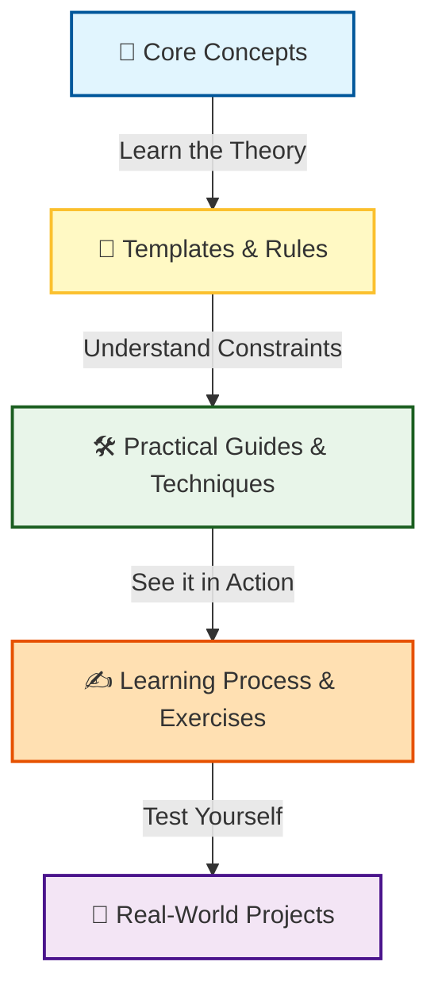
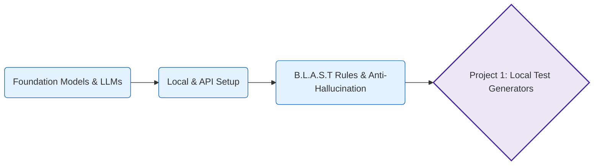
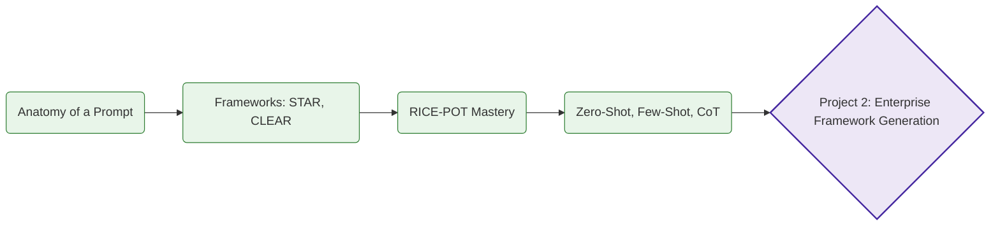
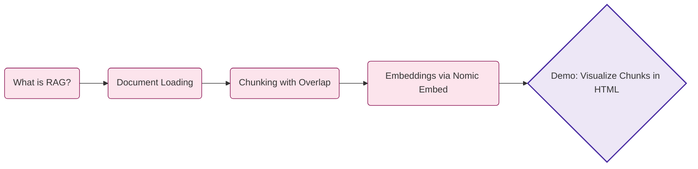

# Automation Desktop Blueprint by 2x - SDET Course

Welcome to the **Automation Desktop Blueprint by 2x** repository! This project serves as a comprehensive guide to understanding and integrating Artificial Intelligence (AI) and Large Language Models (LLMs) into modern software testing and Quality Assurance (QA) workflows.

The repository is structured systematically into chapters, covering theoretical concepts, practical exercises, and real-world projects to take you from fundamentals to advanced AI-assisted test automation.

---

## 🗺️ Course Learning Flow

To get the most out of this repository, we recommend following this progressive workflow for each chapter:



1. **`core_concepts/`**: Start here. Read these markdown files to build your foundational knowledge and terminology.
2. **`rules_checklists/` & `templates/`**: Utilize reusable templates and strict rules (e.g., Anti-Hallucination guidelines, B.L.A.S.T.) to enforce consistency in your AI interactions.
3. **`practical_guides/` & `techniques/`**: Explore these folders for step-by-step tutorials and prompt strategies (like RICE-POT).
4. **`learning_practice/`**: Engage in hands-on, self-directed exercises (and refer to the solutions) to reinforce your learning.
5. **`Project_.../`**: Synthesize and apply everything you have learned to comprehensive testing challenges and enterprise frameworks.

---

## 📖 Chapter 1: LLM Basics

**Directory:** `Chapter_01_LLM_BASICS/`

In this foundational chapter, we explore the basics of Large Language Models (LLMs) and how to leverage them (both local and cloud-based APIs) for generating reliable test automation scripts. We establish critical guardrails like the Anti-Hallucination rules and the B.L.A.S.T. master system prompt to prevent AI drift or fabricated outputs.

### Chapter 1 Learning Path



### Chapter 1 Curriculum & Projects

| Type | Folder / Module | Description |
| :---: | :--- | :--- |
| **📚 Learning** | `core_concepts/` | Architectural fundamentals of Foundation Models and LLM definitions. |
| **📚 Learning** | `practical_guides/` | Practical guidance on setting up and interacting with LLMs locally and via APIs (such as Groq API). |
| **📚 Learning** | `rules_checklists/` | Critical guardrails including the Anti-Hallucination rule-sets and the B.L.A.S.T. framework. |
| **📚 Learning** | `learning_practice/` | Foundational exercises to practice basic LLM interaction skills and test prompt behavior. |
| **🚀 Project** | `Project_01_LocalLLMTestGenerator` | **Standalone App**: Building a standard, self-contained local application for generating tests using local models. |
| **🚀 Project** | `Project_01_LocalLLMTestGenerator_Antigravity` | **Agentic Architecture**: A specialized test generator built using an advanced agentic system (Antigravity). |
| **🚀 Project** | `LocalLLMTestGenBuddy` | **Submodule Component**: A reusable codebase component utilized for assisting local test generation contexts. |

---

## 📖 Chapter 2: Prompt Engineering

**Directory:** `Chapter_02_PROMPT_ENGINEERING/`

This chapter dives deep into the art and science of **Prompt Engineering** tailored specifically for automation engineers. We introduce vital prompt frameworks—like **RICE-POT** (Role, Instructions, Context, Example, Parameters, Output, Tone)—and use advanced techniques to generate enterprise-grade automation frameworks, ensuring strict compliance with production-level standards.

### Chapter 2 Learning Path



### Chapter 2 Curriculum & Projects

| Type | Folder / Module | Description |
| :---: | :--- | :--- |
| **📚 Learning** | `core_concepts/` | The core anatomy of prompts and overviews of standard frameworks like STAR, CLEAR, and CRISP. |
| **📚 Learning** | `techniques/` | Deep-dives into advanced QA techniques: Few-Shot, Chain-of-Thought, Zero-Shot, and Role-playing. |
| **📚 Learning** | `practical_guides/` | Step-by-step practical guides to writing effective QA and automation instructions from scratch. |
| **📚 Learning** | `learning_practice/` | Hands-on prompt engineering exercises with detailed, documented solutions for practical mastery. |
| **🚀 Project** | `Project_02_Prompt_Templates` | **Template Engine**: A repository containing reusable, high-quality prompt templates specifically designed for QA Tasks (e.g., API testing, Bug Reports). |
| **🚀 Project** | `Project_02_REAL_PROJECT_PE` | **Test Planning via LLMs**: Applying prompt engineering to ingest a real-world product context (VWO Platform) to auto-generate thorough Test Plans. |
| **🚀 Project** | `Project_02_RICE_POT_Selenium_FW` | **Framework Generation**: Using the RICE-POT framework to completely architect and generate an enterprise-grade Selenium TestNG Page Object Model. |
| **🚀 Project** | `Project_03_RICE_POT_Playwright_Advance_FQ` | **Advanced UI Testing**: Extending prompt engineering capabilities to architect and build robust end-to-end modern testing solutions using Playwright. |

---

## 📖 Chapter 8: Retrieval Augmented Generation (RAG)

**Directory:** `Chapter_08_RAG/`

In this chapter, we introduce **Retrieval Augmented Generation (RAG)** — the technique that grounds an LLM in your own documents instead of relying purely on its training data. We start with the most important building block of any RAG pipeline: **chunking and embeddings**. Using a small story document about *Promo and The Testing Academy*, we split the text into overlapping chunks and convert each chunk into a 768-dimensional vector using the **Nomic Embed** model running locally through **Ollama**.

### Chapter 8 Learning Path



### Chapter 8 Curriculum & Demo

| Type | Folder / File | Description |
| :---: | :--- | :--- |
| **📄 Document** | `promo_story.txt` | A small narrative document about Promo and The Testing Academy, used as the source corpus for the RAG demo. |
| **🐍 Python** | `rag_chunking.py` | Loads the document, performs sliding-window chunking (300 chars with 50 char overlap), generates embeddings via `nomic-embed-text` on Ollama, prints each chunk + a preview of its 768-dim vector, and writes a styled HTML report. |
| **🌐 HTML** | `chunks_report.html` | A visual, browser-friendly report showing every chunk side by side with its embedding preview — great for understanding what chunking actually looks like. |

### Prerequisites

1. Install [Ollama](https://ollama.com)
2. Pull the embedding model: `ollama pull nomic-embed-text`
3. Install the Python dependency: `pip install requests`

### Run It

```bash
cd Chapter_08_RAG
python3 rag_chunking.py
# then open chunks_report.html in your browser
```

---

*Continue following this repository for future chapters exploring deeper AI integrations!*
